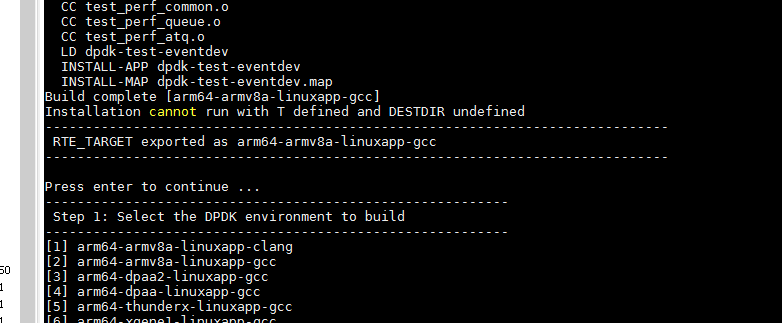

dpdk 数据平面开发套件
=======================
DPDK使用了轮询(polling)而不是中断来处理数据包。在收到数据包时，经DPDK重载的网卡驱动不会通过中断通知CPU，
而是直接将数据包存入内存，交付应用层软件通过DPDK提供的接口来直接处理，这样节省了大量的CPU中断时间和内存拷贝时间。

下载地址

http://core.dpdk.org/download/

编译安装
```
yum install make makecache gcc-c++ patch kernel-devel numactl
cd dpdk-stable-17.11.6
usertools/dpdk-setup.sh
2
```
编译成功会有提示：




巨型页配置
```
usertools/dpdk-setup.sh
[21] Setup hugepage mappings for NUMA systems
[28] List hugepage info from /proc/meminfo
```

绑定dpdk
```
usertools/dpdk-setup.sh
[17] Insert IGB UIO module
[23] Bind Ethernet/Crypto device to IGB UIO module
[22] Display current Ethernet/Crypto device settings


Network devices using DPDK-compatible driver
============================================
0002:e9:00.0 '82599ES 10-Gigabit SFI/SFP+ Network Connection 10fb' drv=igb_uio unused=ixgbe

Network devices using kernel driver
===================================
<none>
```

执行helloworld测试。【文档地址】(https://doc.dpdk.org/guides/linux_gsg/build_sample_apps.html)
```
cd examples/helloworld/
export RTE_SDK=$HOME/DPDK
export RTE_TARGET=x86_64-native-linux-gcc

make
    CC main.o
    LD helloworld
    INSTALL-APP helloworld
    INSTALL-MAP helloworld.map

ls build/app
    helloworld helloworld.map
    
./helloworld -l 0-3 -n 4
```

测试处理
```
/home/PF_RING-6.0.2/userland/examples/pfsend_dir -i dna0 -r10 -n0

watch -d -n 1 IPNetStat 0
```

优化操作：

```
收一核
发一核
IPnet 绑到numctl一个核上， 观察网卡是否在哪一个P上。dpdk在另一个片上

增加内存256
增加处理进程数量
```

# 问题记录

#### 问题1： 缺少numa.h, 
```
/home/lixianfa/dpdk/dpdk-stable-17.11.6/lib/librte_eal/linuxapp/eal/eal_memory.c:56:18: fatal error: numa.h: No such file or directory
```
解决办法
```
sudo yum install numactl-devel
```

#### 问题2： could not split insn
```
/home/me/dpdk-stable-18.11.2/drivers/event/octeontx/timvf_worker.c: In function ‘timvf_timer_arm_burst_sp’:
/home/me/dpdk-stable-18.11.2/drivers/event/octeontx/timvf_worker.c:88:1: error: could not split insn
 }
 ^
(insn 95 98 99 (parallel [
            (set (reg:DI 0 x0 [orig:98 D.8599 ] [98])
                (mem/v:DI (reg/f:DI 21 x21 [orig:88 D.8605 ] [88]) [-1  S8 A64]))
            (set (mem/v:DI (reg/f:DI 21 x21 [orig:88 D.8605 ] [88]) [-1  S8 A64])
                (unspec_volatile:DI [
                        (plus:DI (mem/v:DI (reg/f:DI 21 x21 [orig:88 D.8605 ] [88]) [-1  S8 A64])
                            (const_int -281474976710656 [0xffff000000000000]))
                        (const_int 0 [0])
                    ] UNSPECV_ATOMIC_OP))
            (clobber (reg:CC 66 cc))
            (clobber (reg:DI 1 x1))
            (clobber (reg:SI 2 x2))
        ]) /home/me/dpdk-stable-18.11.2/drivers/event/octeontx/timvf_worker.h:95 1832 {atomic_fetch_adddi}
     (expr_list:REG_UNUSED (reg:CC 66 cc)
        (expr_list:REG_UNUSED (reg:SI 2 x2)
            (expr_list:REG_UNUSED (reg:DI 1 x1)
                (nil)))))
/home/me/dpdk-stable-18.11.2/drivers/event/octeontx/timvf_worker.c:88:1: internal compiler error: in final_scan_insn, at final.c:2897
Please submit a full bug report,
with preprocessed source if appropriate.
See <http://bugzilla.redhat.com/bugzilla> for instructions.
Preprocessed source stored into /tmp/ccDIw6Il.out file, please attach this to your bugreport.
make[6]: *** [timvf_worker.o] Error 1
make[5]: *** [octeontx] Error 2
make[4]: *** [event] Error 2
make[3]: *** [drivers] Error 2
make[2]: *** [all] Error 2
make[1]: *** [pre_install] Error 2
make: *** [install] Error 2
------------------------------------------------------------------------------
 RTE_TARGET exported as arm64-armv8a-linuxapp-gcc
------------------------------------------------------------------------------

Press enter to continue ...
```
还没有解决办法
[https://www.mail-archive.com/dev@dpdk.org/msg121218.html](https://www.mail-archive.com/dev@dpdk.org/msg121218.html)


厂家测试数据
```
ARM-131# show traffic
-----------------------------------------------------------
Interface pps                      Mbps
-----------------------------------------------------------
0         0                        0
1         398106                   1327
ARM-131# show traffic
-----------------------------------------------------------
Interface pps                      Mbps
-----------------------------------------------------------
0         0                        0
1         398106                   1327
ARM-131# show traffic
-----------------------------------------------------------
Interface pps                      Mbps
-----------------------------------------------------------
0         0                        0
1         396911                   1323
ARM-131# show traffic
-----------------------------------------------------------
Interface pps                      Mbps
-----------------------------------------------------------
0         0                        0
1         396527                   1322
ARM-131# show traffic
-----------------------------------------------------------
Interface pps                      Mbps
-----------------------------------------------------------
0         0                        0
1         394882                   1316
ARM-131# show traffic
-----------------------------------------------------------
Interface pps                      Mbps
-----------------------------------------------------------
0         0                        0
1         394882                   1316
ARM-131# show traffic
-----------------------------------------------------------
Interface pps                      Mbps
-----------------------------------------------------------
0         0                        0
1         424770                   1416
ARM-131# show traffic
-----------------------------------------------------------
Interface pps                      Mbps
-----------------------------------------------------------
0         0                        0
1         424770                   1416
ARM-131# show traffic
-----------------------------------------------------------
Interface pps                      Mbps
-----------------------------------------------------------
0         0                        0
1         423611                   1412
ARM-131# show traffic
-----------------------------------------------------------


Tasks: 785 total,   6 running, 427 sleeping,   0 stopped,   0 zombie
%Cpu(s):  2.7 us,  7.3 sy,  0.0 ni, 89.8 id,  0.0 wa,  0.0 hi,  0.2 si,  0.0 st
KiB Mem : 66271616 total, 29970176 free,  6529280 used, 29772160 buff/cache
KiB Swap:  4194240 total,  4194240 free,        0 used. 47201280 avail Mem

  PID USER      PR  NI    VIRT    RES    SHR S  %CPU %MEM     TIME+ COMMAND
22649 root      20   0 2633984   2.0g   2.0g S 215.5  3.1  54:05.93 exam
23455 root      20   0    8512   8000   2112 R  95.7  0.0   2:54.89 tcpreplay
23457 root      20   0    8512   8000   2112 R  95.7  0.0   2:55.43 tcpreplay
23456 root      20   0    8448   7936   2048 R  95.4  0.0   2:54.99 tcpreplay
23459 root      20   0    8512   8000   2048 R  95.1  0.0   2:50.93 tcpreplay
23458 root      20   0    8512   8064   2112 R  94.7  0.0   2:49.99 tcpreplay
23416 root      20   0  113280   5440   2880 S   2.6  0.0   0:11.37 htop
23472 root      20   0  118528   8576   3840 R   1.0  0.0   0:02.30 top
  301 root      20   0       0      0      0 S   0.3  0.0   0:13.58 ksoftirqd/48
16824 root      20   0  498112  16576  10752 S   0.3  0.0   0:00.97 gsd-smartcard
    1 root      20   0  164672  16512   6016 S   0.0  0.0   0:03.82 systemd
    2 root      20   0       0      0      0 S   0.0  0.0   0:00.06 kthreadd
    4 root       0 -20       0      0      0 I   0.0  0.0   0:00.00 kworker/0:0H
    5 root      20   0       0      0      0 I   0.0  0.0   0:00.14 kworker/u128:0
    7 root       0 -20       0      0      0 I   0.0  0.0   0:00.00 mm_percpu_wq
    8 root      20   0       0      0      0 S   0.0  0.0   0:00.29 ksoftirqd/0
    9 root      20   0       0      0      0 I   0.0  0.0   0:05.67 rcu_sched
   10 root      20   0       0      0      0 I   0.0  0.0   0:00.00 rcu_bh
   11 root      rt   0       0      0      0 S   0.0  0.0   0:00.06 migration/0


tcpreplay -i enahisic2i3 -M 10000 -l 0 link.pcap
tcpreplay -i enahisic2i3 -M 10000 -l 0 link.pcap
tcpreplay -i enahisic2i3 -M 10000 -l 0 link.pcap
Interface pps                      Mbps
-----------------------------------------------------------
0         0                        0
1         423611                   1412
ARM-131# show traffic
-----------------------------------------------------------
Interface pps                      Mbps
-----------------------------------------------------------
0         0                        0
1         424017                   1413
ARM-131# show traffic
-----------------------------------------------------------
Interface pps                      Mbps
-----------------------------------------------------------
0         0                        0
1         423236                   1411
ARM-131# show traffic
```
dpdk文档地址：

[dpdk文档地址](https://doc.dpdk.org/guides/linux_gsg/quick_start.html)

