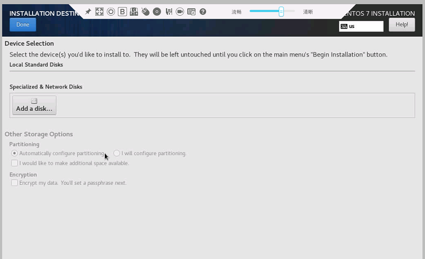
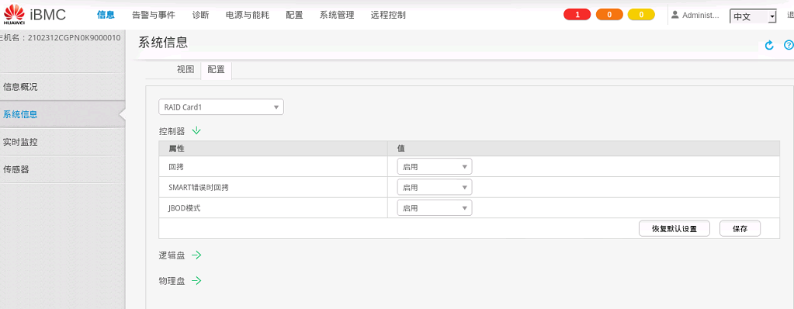
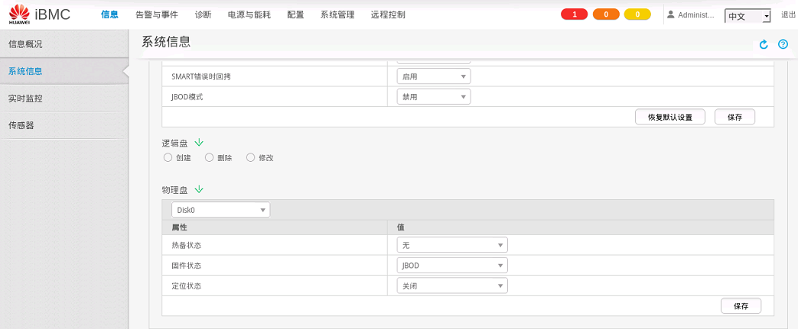
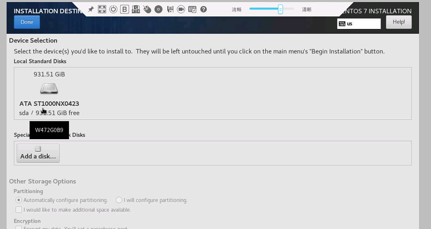

安装CentOS时，安装界面无法找到硬盘
=======================================

安装CentOS的界面，没有看到有硬盘

原因可能是新设备硬盘没有配置raid卡，可以选择组raid或者是硬盘直通。

这里介绍设置硬盘直通模式， 也就是JBOD。 把raid卡的JBOD模式由禁用改成启用

把物理盘的的模式也改成JBOD

这个时候重新回到安装界面刷新， 就可以看到硬盘了
