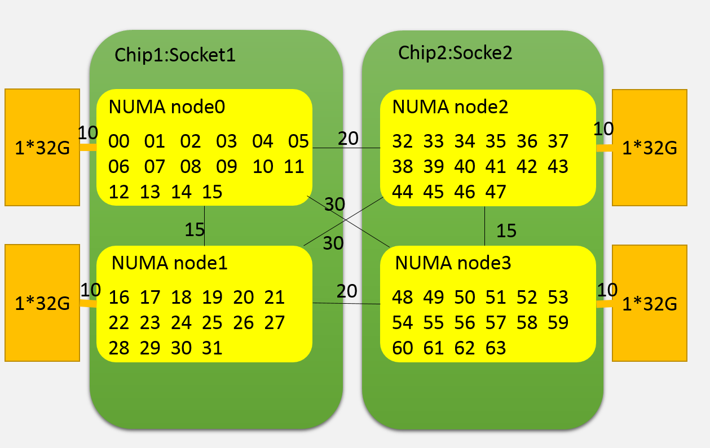
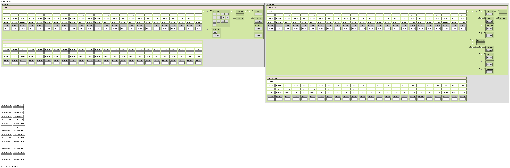
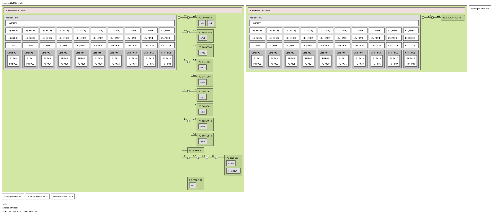

简单对比Intel CPU 和 鲲鹏CPU
======================================
cpu有很多需要信息需要了解，numa是其中之一。  
NUMA架构，非统一内存访问架构（英语：Non-uniform memory access，简称NUMA）。  
在numa出现之前， cpu通过内存控制器访问内存， 显然，当cpu核数逐渐增多的今天，内存控制器会成为瓶颈。这个时候就考虑内存控制器进行拆分，内存平均分配到各个die上， cpu访问本地的内存时速度快，跨片访问慢。类似与这个图：  
  
在做性能优化时，针对numa结构的绑核可以让数据访问更快。 有时候也经常会被问硬盘是在哪个numa节点上的， 网卡是在哪个numa节点上的，中断怎么绑定效率最高，有必要了解一下。

# 主要设备信息

|服务器型号			|CPU型号	 		|
|:--------------	|:-----------		|
|泰山 TaiShan 2280 V2	| Kunpeng 920-4826							|
|戴尔 PowerEdge R730	| Intel(R) Xeon(R) CPU E5-2630 v4 @ 2.20GHz	|

# cpu 信息
这里以lspci的输出做对比
### 泰山 鲲鹏 920-4826

```json
Architecture:          aarch64			#ARM64架构
Byte Order:            Little Endian	#小端
CPU(s):                96				#cpu数量96核
On-line CPU(s) list:   0-95				#cpu的编号
Thread(s) per core:    1				#单线程， 不支持超线程
Core(s) per socket:    48				#每个物理核的core数量
Socket(s):             2				#一共有两个物理CPU
NUMA node(s):          4				#numa节点
Model:                 0
BogoMIPS:              200.00
L1d cache:             64K				#L1 data cache 数据cache
L1i cache:             64K				#L1 instruction cache 指令cache
L2 cache:              512K				#L2 cache
L3 cache:              32768K			#L3 cache
NUMA node0 CPU(s):     0-23				#numa节点1的CPU
NUMA node1 CPU(s):     24-47			#numa节点2的CPU
NUMA node2 CPU(s):     48-71			#numa节点3的CPU
NUMA node3 CPU(s):     72-95			#numa节点4的CPU
Flags:                 fp asimd evtstrm aes pmull sha1 sha2 crc32 atomics fphp asimdhp cpuid asimdrdm jscvt fcma dcpop

```


### 戴尔 PowerEdge R730 Intel(R) Xeon(R) CPU E5-2630 

```text
Architecture:          x86_64			#X86架构
CPU op-mode(s):        32-bit, 64-bit	#同时支持32位和64位运行模式
Byte Order:            Little Endian	#小端系统
CPU(s):                40				#cpu数量40
On-line CPU(s) list:   0-39				#cpu的编号
Thread(s) per core:    2				#超线程数量，一般情况下 CPUs 40 = Thread(s) per core × Core(s) per socket × Socket(s)
Core(s) per socket:    10				#每个物理核的core数量
Socket(s):             2				#一共有两个物理CPU。
NUMA node(s):          2				#两个numa节点
Vendor ID:             GenuineIntel
CPU family:            6
Model:                 79
Model name:            Intel(R) Xeon(R) CPU E5-2630 v4 @ 2.20GHz	#主频2.2GHz
Stepping:              1
CPU MHz:               1720.227
CPU max MHz:           3100.0000		#超频
CPU min MHz:           1200.0000
BogoMIPS:              4400.03
Virtualization:        VT-x				#支持超线程技术
L1d cache:             32K				#L1 data cache 数据cache
L1i cache:             32K				#L1 instruction cache 指令cache
L2 cache:              256K				#L2 cache
L3 cache:              25600K			#L3 cache
NUMA node0 CPU(s):     0,2,4,6,8,10,12,14,16,18,20,22,24,26,28,30,32,34,36,38 #numa节点1的CPU
NUMA node1 CPU(s):     1,3,5,7,9,11,13,15,17,19,21,23,25,27,29,31,33,35,37,39 #numa节点1的CPU
Flags:                 fpu vme de pse tsc msr pae mce cx8 apic sep mtrr pge mca cmov pat pse36 clflush dts acpi mmx fxsr sse sse2 ss ht tm pbe syscall nx pdpe1gb rdtscp lm constant_tsc arch_perfmon pebs bts rep_good nopl xtopology nonstop_tsc aperfmperf eagerfpu pni pclmulqdq dtes64 monitor ds_cpl vmx smx est tm2 ssse3 sdbg fma cx16 xtpr pdcm pcid dca sse4_1 sse4_2 x2apic movbe popcnt tsc_deadline_timer aes xsave avx f16c rdrand lahf_lm abm 3dnowprefetch epb cat_l3 cdp_l3 intel_pt ibrs ibpb stibp tpr_shadow vnmi flexpriority ept vpid fsgsbase tsc_adjust bmi1 hle avx2 smep bmi2 erms invpcid rtm cqm rdt_a rdseed adx smap xsaveopt cqm_llc cqm_occup_llc cqm_mbm_total cqm_mbm_local dtherm ida arat pln pts spec_ctrl intel_stibp
```

# numa 拓扑
这里以lstopo的输出作为对比

### 泰山 鲲鹏 920-4826

```json
Machine (188GB total):
  Package L#0
    NUMANode L#0 (P#0 46GB)
      L3 L#0 (32MB)
        L2 L#0 (512KB) + L1d L#0 (64KB) + L1i L#0 (64KB) + Core L#0 + PU L#0 (P#0)
        L2 L#1 (512KB) + L1d L#1 (64KB) + L1i L#1 (64KB) + Core L#1 + PU L#1 (P#1)
        L2 L#2 (512KB) + L1d L#2 (64KB) + L1i L#2 (64KB) + Core L#2 + PU L#2 (P#2)
        L2 L#3 (512KB) + L1d L#3 (64KB) + L1i L#3 (64KB) + Core L#3 + PU L#3 (P#3)
        L2 L#4 (512KB) + L1d L#4 (64KB) + L1i L#4 (64KB) + Core L#4 + PU L#4 (P#4)
        L2 L#5 (512KB) + L1d L#5 (64KB) + L1i L#5 (64KB) + Core L#5 + PU L#5 (P#5)
        L2 L#6 (512KB) + L1d L#6 (64KB) + L1i L#6 (64KB) + Core L#6 + PU L#6 (P#6)
        L2 L#7 (512KB) + L1d L#7 (64KB) + L1i L#7 (64KB) + Core L#7 + PU L#7 (P#7)
        L2 L#8 (512KB) + L1d L#8 (64KB) + L1i L#8 (64KB) + Core L#8 + PU L#8 (P#8)
        L2 L#9 (512KB) + L1d L#9 (64KB) + L1i L#9 (64KB) + Core L#9 + PU L#9 (P#9)
        L2 L#10 (512KB) + L1d L#10 (64KB) + L1i L#10 (64KB) + Core L#10 + PU L#10 (P#10)
        L2 L#11 (512KB) + L1d L#11 (64KB) + L1i L#11 (64KB) + Core L#11 + PU L#11 (P#11)
        L2 L#12 (512KB) + L1d L#12 (64KB) + L1i L#12 (64KB) + Core L#12 + PU L#12 (P#12)
        L2 L#13 (512KB) + L1d L#13 (64KB) + L1i L#13 (64KB) + Core L#13 + PU L#13 (P#13)
        L2 L#14 (512KB) + L1d L#14 (64KB) + L1i L#14 (64KB) + Core L#14 + PU L#14 (P#14)
        L2 L#15 (512KB) + L1d L#15 (64KB) + L1i L#15 (64KB) + Core L#15 + PU L#15 (P#15)
        L2 L#16 (512KB) + L1d L#16 (64KB) + L1i L#16 (64KB) + Core L#16 + PU L#16 (P#16)
        L2 L#17 (512KB) + L1d L#17 (64KB) + L1i L#17 (64KB) + Core L#17 + PU L#17 (P#17)
        L2 L#18 (512KB) + L1d L#18 (64KB) + L1i L#18 (64KB) + Core L#18 + PU L#18 (P#18)
        L2 L#19 (512KB) + L1d L#19 (64KB) + L1i L#19 (64KB) + Core L#19 + PU L#19 (P#19)
        L2 L#20 (512KB) + L1d L#20 (64KB) + L1i L#20 (64KB) + Core L#20 + PU L#20 (P#20)
        L2 L#21 (512KB) + L1d L#21 (64KB) + L1i L#21 (64KB) + Core L#21 + PU L#21 (P#21)
        L2 L#22 (512KB) + L1d L#22 (64KB) + L1i L#22 (64KB) + Core L#22 + PU L#22 (P#22)
        L2 L#23 (512KB) + L1d L#23 (64KB) + L1i L#23 (64KB) + Core L#23 + PU L#23 (P#23)
      HostBridge L#0
        PCIBridge
          PCI 1000:0016
            Block(Disk) L#0 "sdj"
            Block(Disk) L#1 "sda"
            Block(Disk) L#2 "sdh"
            Block(Disk) L#3 "sdf"
            Block(Disk) L#4 "sdd"
            Block(Disk) L#5 "sdk"
            Block(Disk) L#6 "sdb"
            Block(Disk) L#7 "sdm"
            Block(Disk) L#8 "sdi"
            Block(Disk) L#9 "sdg"
            Block(Disk) L#10 "sde"
            Block(Disk) L#11 "sdl"
            Block(Disk) L#12 "sdc"
        PCIBridge
          PCI 19e5:1711
            GPU L#13 "card0"
            GPU L#14 "controlD64"
      HostBridge L#3
        PCI 19e5:a230
        PCI 19e5:a235
        PCI 19e5:a230
      HostBridge L#4
        PCIBridge
          PCI 19e5:a222
            Net L#15 "enp125s0f0"
          PCI 19e5:a221
            Net L#16 "enp125s0f1"
          PCI 19e5:a222
            Net L#17 "enp125s0f2"
          PCI 19e5:a221
            Net L#18 "enp125s0f3"
    NUMANode L#1 (P#1 47GB) + L3 L#1 (32MB)
      L2 L#24 (512KB) + L1d L#24 (64KB) + L1i L#24 (64KB) + Core L#24 + PU L#24 (P#24)
      L2 L#25 (512KB) + L1d L#25 (64KB) + L1i L#25 (64KB) + Core L#25 + PU L#25 (P#25)
      L2 L#26 (512KB) + L1d L#26 (64KB) + L1i L#26 (64KB) + Core L#26 + PU L#26 (P#26)
      L2 L#27 (512KB) + L1d L#27 (64KB) + L1i L#27 (64KB) + Core L#27 + PU L#27 (P#27)
      L2 L#28 (512KB) + L1d L#28 (64KB) + L1i L#28 (64KB) + Core L#28 + PU L#28 (P#28)
      L2 L#29 (512KB) + L1d L#29 (64KB) + L1i L#29 (64KB) + Core L#29 + PU L#29 (P#29)
      L2 L#30 (512KB) + L1d L#30 (64KB) + L1i L#30 (64KB) + Core L#30 + PU L#30 (P#30)
      L2 L#31 (512KB) + L1d L#31 (64KB) + L1i L#31 (64KB) + Core L#31 + PU L#31 (P#31)
      L2 L#32 (512KB) + L1d L#32 (64KB) + L1i L#32 (64KB) + Core L#32 + PU L#32 (P#32)
      L2 L#33 (512KB) + L1d L#33 (64KB) + L1i L#33 (64KB) + Core L#33 + PU L#33 (P#33)
      L2 L#34 (512KB) + L1d L#34 (64KB) + L1i L#34 (64KB) + Core L#34 + PU L#34 (P#34)
      L2 L#35 (512KB) + L1d L#35 (64KB) + L1i L#35 (64KB) + Core L#35 + PU L#35 (P#35)
      L2 L#36 (512KB) + L1d L#36 (64KB) + L1i L#36 (64KB) + Core L#36 + PU L#36 (P#36)
      L2 L#37 (512KB) + L1d L#37 (64KB) + L1i L#37 (64KB) + Core L#37 + PU L#37 (P#37)
      L2 L#38 (512KB) + L1d L#38 (64KB) + L1i L#38 (64KB) + Core L#38 + PU L#38 (P#38)
      L2 L#39 (512KB) + L1d L#39 (64KB) + L1i L#39 (64KB) + Core L#39 + PU L#39 (P#39)
      L2 L#40 (512KB) + L1d L#40 (64KB) + L1i L#40 (64KB) + Core L#40 + PU L#40 (P#40)
      L2 L#41 (512KB) + L1d L#41 (64KB) + L1i L#41 (64KB) + Core L#41 + PU L#41 (P#41)
      L2 L#42 (512KB) + L1d L#42 (64KB) + L1i L#42 (64KB) + Core L#42 + PU L#42 (P#42)
      L2 L#43 (512KB) + L1d L#43 (64KB) + L1i L#43 (64KB) + Core L#43 + PU L#43 (P#43)
      L2 L#44 (512KB) + L1d L#44 (64KB) + L1i L#44 (64KB) + Core L#44 + PU L#44 (P#44)
      L2 L#45 (512KB) + L1d L#45 (64KB) + L1i L#45 (64KB) + Core L#45 + PU L#45 (P#45)
      L2 L#46 (512KB) + L1d L#46 (64KB) + L1i L#46 (64KB) + Core L#46 + PU L#46 (P#46)
      L2 L#47 (512KB) + L1d L#47 (64KB) + L1i L#47 (64KB) + Core L#47 + PU L#47 (P#47)
  Package L#1
    NUMANode L#2 (P#2 47GB)
      L3 L#2 (32MB)
        L2 L#48 (512KB) + L1d L#48 (64KB) + L1i L#48 (64KB) + Core L#48 + PU L#48 (P#48)
        L2 L#49 (512KB) + L1d L#49 (64KB) + L1i L#49 (64KB) + Core L#49 + PU L#49 (P#49)
        L2 L#50 (512KB) + L1d L#50 (64KB) + L1i L#50 (64KB) + Core L#50 + PU L#50 (P#50)
        L2 L#51 (512KB) + L1d L#51 (64KB) + L1i L#51 (64KB) + Core L#51 + PU L#51 (P#51)
        L2 L#52 (512KB) + L1d L#52 (64KB) + L1i L#52 (64KB) + Core L#52 + PU L#52 (P#52)
        L2 L#53 (512KB) + L1d L#53 (64KB) + L1i L#53 (64KB) + Core L#53 + PU L#53 (P#53)
        L2 L#54 (512KB) + L1d L#54 (64KB) + L1i L#54 (64KB) + Core L#54 + PU L#54 (P#54)
        L2 L#55 (512KB) + L1d L#55 (64KB) + L1i L#55 (64KB) + Core L#55 + PU L#55 (P#55)
        L2 L#56 (512KB) + L1d L#56 (64KB) + L1i L#56 (64KB) + Core L#56 + PU L#56 (P#56)
        L2 L#57 (512KB) + L1d L#57 (64KB) + L1i L#57 (64KB) + Core L#57 + PU L#57 (P#57)
        L2 L#58 (512KB) + L1d L#58 (64KB) + L1i L#58 (64KB) + Core L#58 + PU L#58 (P#58)
        L2 L#59 (512KB) + L1d L#59 (64KB) + L1i L#59 (64KB) + Core L#59 + PU L#59 (P#59)
        L2 L#60 (512KB) + L1d L#60 (64KB) + L1i L#60 (64KB) + Core L#60 + PU L#60 (P#60)
        L2 L#61 (512KB) + L1d L#61 (64KB) + L1i L#61 (64KB) + Core L#61 + PU L#61 (P#61)
        L2 L#62 (512KB) + L1d L#62 (64KB) + L1i L#62 (64KB) + Core L#62 + PU L#62 (P#62)
        L2 L#63 (512KB) + L1d L#63 (64KB) + L1i L#63 (64KB) + Core L#63 + PU L#63 (P#63)
        L2 L#64 (512KB) + L1d L#64 (64KB) + L1i L#64 (64KB) + Core L#64 + PU L#64 (P#64)
        L2 L#65 (512KB) + L1d L#65 (64KB) + L1i L#65 (64KB) + Core L#65 + PU L#65 (P#65)
        L2 L#66 (512KB) + L1d L#66 (64KB) + L1i L#66 (64KB) + Core L#66 + PU L#66 (P#66)
        L2 L#67 (512KB) + L1d L#67 (64KB) + L1i L#67 (64KB) + Core L#67 + PU L#67 (P#67)
        L2 L#68 (512KB) + L1d L#68 (64KB) + L1i L#68 (64KB) + Core L#68 + PU L#68 (P#68)
        L2 L#69 (512KB) + L1d L#69 (64KB) + L1i L#69 (64KB) + Core L#69 + PU L#69 (P#69)
        L2 L#70 (512KB) + L1d L#70 (64KB) + L1i L#70 (64KB) + Core L#70 + PU L#70 (P#70)
        L2 L#71 (512KB) + L1d L#71 (64KB) + L1i L#71 (64KB) + Core L#71 + PU L#71 (P#71)
      HostBridge L#6
        PCIBridge
          PCIBridge
            PCIBridge
              PCI 19e5:1822
                Net L#19 "enp131s0"
            PCIBridge
              PCI 19e5:1822
                Net L#20 "enp132s0"
            PCIBridge
              PCI 19e5:1822
                Net L#21 "enp133s0"
            PCIBridge
              PCI 19e5:1822
                Net L#22 "enp134s0"
        PCIBridge
          PCI 19e5:3714
        PCIBridge
          PCI 19e5:3714
        PCIBridge
          PCIBridge
            PCIBridge
              PCI 19e5:1822
                Net L#23 "enp141s0"
            PCIBridge
              PCI 19e5:1822
                Net L#24 "enp142s0"
            PCIBridge
              PCI 19e5:1822
                Net L#25 "enp143s0"
            PCIBridge
              PCI 19e5:1822
                Net L#26 "enp144s0"
      HostBridge L#21
        PCI 19e5:a230
        PCI 19e5:a235
        PCI 19e5:a230
    NUMANode L#3 (P#3 47GB) + L3 L#3 (32MB)
      L2 L#72 (512KB) + L1d L#72 (64KB) + L1i L#72 (64KB) + Core L#72 + PU L#72 (P#72)
      L2 L#73 (512KB) + L1d L#73 (64KB) + L1i L#73 (64KB) + Core L#73 + PU L#73 (P#73)
      L2 L#74 (512KB) + L1d L#74 (64KB) + L1i L#74 (64KB) + Core L#74 + PU L#74 (P#74)
      L2 L#75 (512KB) + L1d L#75 (64KB) + L1i L#75 (64KB) + Core L#75 + PU L#75 (P#75)
      L2 L#76 (512KB) + L1d L#76 (64KB) + L1i L#76 (64KB) + Core L#76 + PU L#76 (P#76)
      L2 L#77 (512KB) + L1d L#77 (64KB) + L1i L#77 (64KB) + Core L#77 + PU L#77 (P#77)
      L2 L#78 (512KB) + L1d L#78 (64KB) + L1i L#78 (64KB) + Core L#78 + PU L#78 (P#78)
      L2 L#79 (512KB) + L1d L#79 (64KB) + L1i L#79 (64KB) + Core L#79 + PU L#79 (P#79)
      L2 L#80 (512KB) + L1d L#80 (64KB) + L1i L#80 (64KB) + Core L#80 + PU L#80 (P#80)
      L2 L#81 (512KB) + L1d L#81 (64KB) + L1i L#81 (64KB) + Core L#81 + PU L#81 (P#81)
      L2 L#82 (512KB) + L1d L#82 (64KB) + L1i L#82 (64KB) + Core L#82 + PU L#82 (P#82)
      L2 L#83 (512KB) + L1d L#83 (64KB) + L1i L#83 (64KB) + Core L#83 + PU L#83 (P#83)
      L2 L#84 (512KB) + L1d L#84 (64KB) + L1i L#84 (64KB) + Core L#84 + PU L#84 (P#84)
      L2 L#85 (512KB) + L1d L#85 (64KB) + L1i L#85 (64KB) + Core L#85 + PU L#85 (P#85)
      L2 L#86 (512KB) + L1d L#86 (64KB) + L1i L#86 (64KB) + Core L#86 + PU L#86 (P#86)
      L2 L#87 (512KB) + L1d L#87 (64KB) + L1i L#87 (64KB) + Core L#87 + PU L#87 (P#87)
      L2 L#88 (512KB) + L1d L#88 (64KB) + L1i L#88 (64KB) + Core L#88 + PU L#88 (P#88)
      L2 L#89 (512KB) + L1d L#89 (64KB) + L1i L#89 (64KB) + Core L#89 + PU L#89 (P#89)
      L2 L#90 (512KB) + L1d L#90 (64KB) + L1i L#90 (64KB) + Core L#90 + PU L#90 (P#90)
      L2 L#91 (512KB) + L1d L#91 (64KB) + L1i L#91 (64KB) + Core L#91 + PU L#91 (P#91)
      L2 L#92 (512KB) + L1d L#92 (64KB) + L1i L#92 (64KB) + Core L#92 + PU L#92 (P#92)
      L2 L#93 (512KB) + L1d L#93 (64KB) + L1i L#93 (64KB) + Core L#93 + PU L#93 (P#93)
      L2 L#94 (512KB) + L1d L#94 (64KB) + L1i L#94 (64KB) + Core L#94 + PU L#94 (P#94)
      L2 L#95 (512KB) + L1d L#95 (64KB) + L1i L#95 (64KB) + Core L#95 + PU L#95 (P#95)
  Misc(MemoryModule)
  Misc(MemoryModule)
  Misc(MemoryModule)
  Misc(MemoryModule)
  Misc(MemoryModule)
  Misc(MemoryModule)
  Misc(MemoryModule)
  Misc(MemoryModule)
  Misc(MemoryModule)
  Misc(MemoryModule)
  Misc(MemoryModule)
  Misc(MemoryModule)
  Misc(MemoryModule)
  Misc(MemoryModule)
  Misc(MemoryModule)
  Misc(MemoryModule)
  Misc(MemoryModule)
  Misc(MemoryModule)
  Misc(MemoryModule)
  Misc(MemoryModule)
  Misc(MemoryModule)
  Misc(MemoryModule)
  Misc(MemoryModule)
  Misc(MemoryModule)
  Misc(MemoryModule)
  Misc(MemoryModule)
  Misc(MemoryModule)
  Misc(MemoryModule)
  Misc(MemoryModule)
  Misc(MemoryModule)
  Misc(MemoryModule)
  Misc(MemoryModule)
[root@ARM server home]#
```
拓扑图是：   
  

解读一下：

`Machine (188GB total)	` 主机188GB内存。 可以用free -g命令进行确认  
`Package L#0			`	独立的物理CPU封装， 这台服务器上有4826有两个CPU。 整个服务器一共64核  
`Package L#0			`	独立的物理CPU封装， 这台服务器上有4826有两个CPU。 整个服务器一共64核  
`NUMANode L#0 (P#0 46GB)`	numa node 0， 由46G直连内存。暂时不明白为什么是47GB  
`NUMANode L#1 (P#1 47GB)`	numa node 0， 由47G直连内存  
`NUMANode L#2 (P#2 47GB)`	numa node 0， 由47G直连内存  
`NUMANode L#3 (P#3 47GB)`	numa node 0， 由47G直连内存  
`L3 L#0 (32MB)`	node 0 的L3 cache，32MB  
`L3 L#1 (32MB)`	node 1 的L3 cache，32MB  
`L3 L#2 (32MB)`	node 2 的L3 cache，32MB  
`L3 L#3 (32MB)`	node 3 的L3 cache，32MB  
`L2 L#0 (512KB) + L1d L#0 (64KB) + L1i L#0 (64KB) + Core L#0 + PU L#0 (P#0)`  
一行代表一个核心，L#i = Instruction Cache, L#d表示 Data Cache. L1 = a Level 1 cache. "PU P#" = Processing Unit Processor 可以看到每个node上挂了24个CPU,一共4个numa节点96个CPU  
`HostBridge L#0` 主桥 可以看到不是每个CPU下面都挂了一样的主桥  
`HostBridge L#3` 主桥  
`HostBridge L#4` 主桥  
`HostBridge L#6` 主桥  
`HostBridge L#21`主桥  
`Block(Disk) L#0 "sdj"` 挂在PCI主桥下的硬盘，可以根据pci地址进行查询：lspci -nn| grep 1000:0016  
`Net L#15 "enp125s0f0"` 这个是板载网卡。  
`Net L#25 "enp143s0` 这个是1822网卡，可以根据pci地址查询：lspci -nn | grep 19e5:1822,如下文
`Misc(MemoryModule)` 内存插槽数量

```
[root@ARM server home]# lspci -nn | grep 19e5:1822
83:00.0 Ethernet controller [0200]: Huawei Technologies Co., Ltd. Hi1822 Family (4*25GE) [19e5:1822] (rev 45)
84:00.0 Ethernet controller [0200]: Huawei Technologies Co., Ltd. Hi1822 Family (4*25GE) [19e5:1822] (rev 45)
85:00.0 Ethernet controller [0200]: Huawei Technologies Co., Ltd. Hi1822 Family (4*25GE) [19e5:1822] (rev 45)
86:00.0 Ethernet controller [0200]: Huawei Technologies Co., Ltd. Hi1822 Family (4*25GE) [19e5:1822] (rev 45)
8d:00.0 Ethernet controller [0200]: Huawei Technologies Co., Ltd. Hi1822 Family (4*25GE) [19e5:1822] (rev 45)
8e:00.0 Ethernet controller [0200]: Huawei Technologies Co., Ltd. Hi1822 Family (4*25GE) [19e5:1822] (rev 45)
8f:00.0 Ethernet controller [0200]: Huawei Technologies Co., Ltd. Hi1822 Family (4*25GE) [19e5:1822] (rev 45)
90:00.0 Ethernet controller [0200]: Huawei Technologies Co., Ltd. Hi1822 Family (4*25GE) [19e5:1822] (rev 45)
```

### 戴尔 PowerEdge R730 Intel(R) Xeon(R) CPU E5-2630 
```json
Machine (128GB total):
  NUMANode L#0 (P#0 64GB)
    Package L#0 + L3 L#0 (25MB)
      L2 L#0 (256KB) + L1d L#0 (32KB) + L1i L#0 (32KB) + Core L#0
        PU L#0 (P#0)
        PU L#1 (P#20)
      L2 L#1 (256KB) + L1d L#1 (32KB) + L1i L#1 (32KB) + Core L#1
        PU L#2 (P#2)
        PU L#3 (P#22)
      L2 L#2 (256KB) + L1d L#2 (32KB) + L1i L#2 (32KB) + Core L#2
        PU L#4 (P#4)
        PU L#5 (P#24)
      L2 L#3 (256KB) + L1d L#3 (32KB) + L1i L#3 (32KB) + Core L#3
        PU L#6 (P#6)
        PU L#7 (P#26)
      L2 L#4 (256KB) + L1d L#4 (32KB) + L1i L#4 (32KB) + Core L#4
        PU L#8 (P#8)
        PU L#9 (P#28)
      L2 L#5 (256KB) + L1d L#5 (32KB) + L1i L#5 (32KB) + Core L#5
        PU L#10 (P#10)
        PU L#11 (P#30)
      L2 L#6 (256KB) + L1d L#6 (32KB) + L1i L#6 (32KB) + Core L#6
        PU L#12 (P#12)
        PU L#13 (P#32)
      L2 L#7 (256KB) + L1d L#7 (32KB) + L1i L#7 (32KB) + Core L#7
        PU L#14 (P#14)
        PU L#15 (P#34)
      L2 L#8 (256KB) + L1d L#8 (32KB) + L1i L#8 (32KB) + Core L#8
        PU L#16 (P#16)
        PU L#17 (P#36)
      L2 L#9 (256KB) + L1d L#9 (32KB) + L1i L#9 (32KB) + Core L#9
        PU L#18 (P#18)
        PU L#19 (P#38)
    HostBridge L#0
      PCIBridge
        PCI 1000:005d
          Block(Disk) L#0 "sda"
          Block(Disk) L#1 "sdb"
      PCIBridge
        PCI 8086:154d
          Net L#2 "p7p1"
        PCI 8086:154d
          Net L#3 "p7p2"
      PCIBridge
        PCI 14e4:165f
          Net L#4 "em3"
        PCI 14e4:165f
          Net L#5 "em4"
      PCIBridge
        PCI 14e4:165f
          Net L#6 "em1"
        PCI 14e4:165f
          Net L#7 "em2"
      PCIBridge
        PCI 8086:154d
          Net L#8 "p5p1"
        PCI 8086:154d
          Net L#9 "p5p2"
      PCI 8086:8d62
      PCIBridge
        PCIBridge
          PCIBridge
            PCIBridge
              PCI 102b:0534
                GPU L#10 "card0"
                GPU L#11 "controlD64"
      PCI 8086:8d02
        Block(Removable Media Device) L#12 "sr0"
  NUMANode L#1 (P#1 64GB)
    Package L#1 + L3 L#1 (25MB)
      L2 L#10 (256KB) + L1d L#10 (32KB) + L1i L#10 (32KB) + Core L#10
        PU L#20 (P#1)
        PU L#21 (P#21)
      L2 L#11 (256KB) + L1d L#11 (32KB) + L1i L#11 (32KB) + Core L#11
        PU L#22 (P#3)
        PU L#23 (P#23)
      L2 L#12 (256KB) + L1d L#12 (32KB) + L1i L#12 (32KB) + Core L#12
        PU L#24 (P#5)
        PU L#25 (P#25)
      L2 L#13 (256KB) + L1d L#13 (32KB) + L1i L#13 (32KB) + Core L#13
        PU L#26 (P#7)
        PU L#27 (P#27)
      L2 L#14 (256KB) + L1d L#14 (32KB) + L1i L#14 (32KB) + Core L#14
        PU L#28 (P#9)
        PU L#29 (P#29)
      L2 L#15 (256KB) + L1d L#15 (32KB) + L1i L#15 (32KB) + Core L#15
        PU L#30 (P#11)
        PU L#31 (P#31)
      L2 L#16 (256KB) + L1d L#16 (32KB) + L1i L#16 (32KB) + Core L#16
        PU L#32 (P#13)
        PU L#33 (P#33)
      L2 L#17 (256KB) + L1d L#17 (32KB) + L1i L#17 (32KB) + Core L#17
        PU L#34 (P#15)
        PU L#35 (P#35)
      L2 L#18 (256KB) + L1d L#18 (32KB) + L1i L#18 (32KB) + Core L#18
        PU L#36 (P#17)
        PU L#37 (P#37)
      L2 L#19 (256KB) + L1d L#19 (32KB) + L1i L#19 (32KB) + Core L#19
        PU L#38 (P#19)
        PU L#39 (P#39)
    HostBridge L#10
      PCIBridge
        2 x { PCI 1077:2532 }
  Misc(MemoryModule)
  Misc(MemoryModule)
  Misc(MemoryModule)
  Misc(MemoryModule)
```
拓扑图是：  


这里也解读一下：  
kunpeng 920 和 intel 2630都是两个物理核，也就是服务器上经常能看到两个非常大的散热器。 区别是，intel CPU有超线程， 也就是说一个核心可以跑两个线程， 也就相当于一核等于2核。
```json
      L2 L#0 (256KB) + L1d L#0 (32KB) + L1i L#0 (32KB) + Core L#0
        PU L#0 (P#0)
        PU L#1 (P#20)
```

# 网卡、内存在哪个numa节点上。
从lstopo来看， ARM的板载网卡插在了node0上， 1822两个都是插在node2上。在pci设备下查询结果一致。
```
for pcia in $(lspci -nn | grep 1822 | awk -F "[ ,:]" '{print $1}');do
>     cat /sys/bus/pci/devices/0000\:${pcia}\:00.0/numa_node
> done
2
2
2
2
2
2
2
2
2
2
2
2
2
2
2
2
2
2
```

内存从这里好像看不出来， 但是可以知道每个node的内存时相等的，只要按照服务器添加内存条的方式添加即可。


# 总结
这里不是做性能上的对比， 可以看到两款服务是不一样规格的，也很鲲鹏难具有可比性。再没有授权的情况下， 也不敢下结论性的言论。如果想要了解更多的泰山或者鲲鹏处理器，可以访问华为官网。