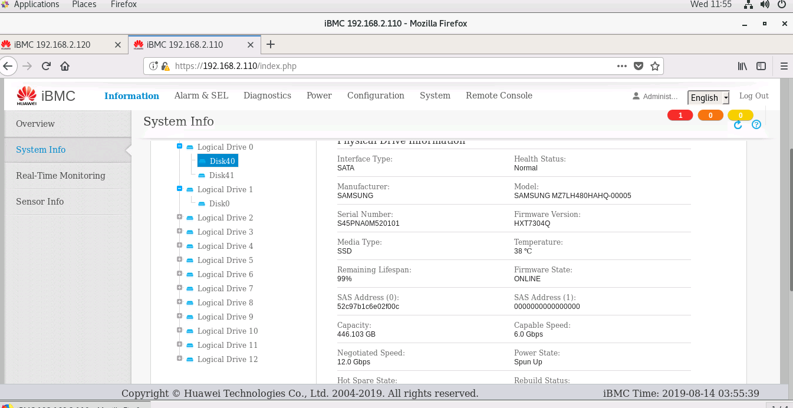
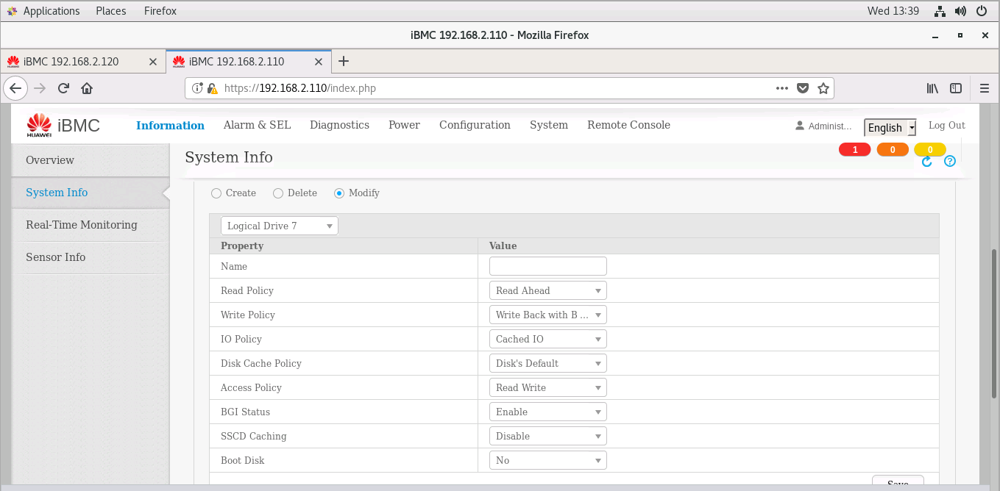
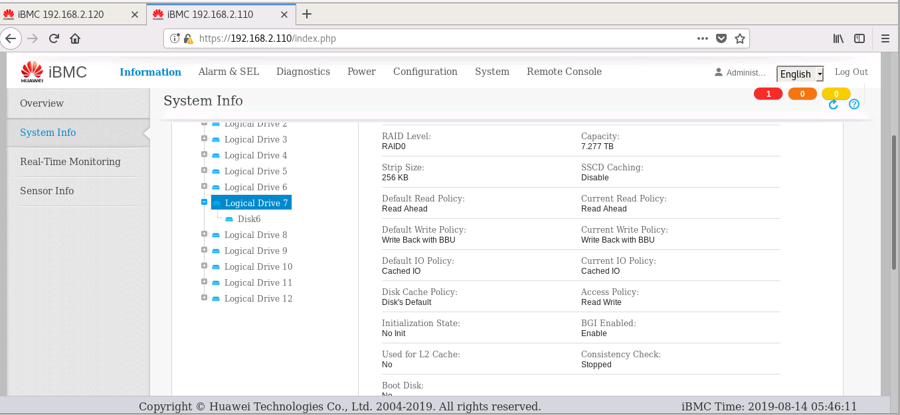
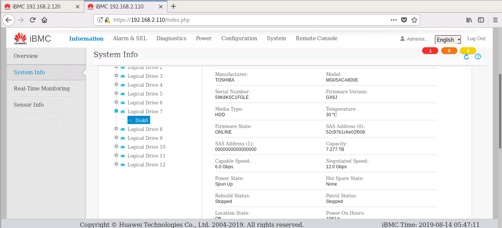

硬盘测试
================

Taishan 2280 V2

系统盘是2块三星480G固态硬盘做raid1, 12个东芝8T HDD，单盘raid0.





硬件信息汇总：

```perl
系统盘            : 2块三星480G固态硬盘raid1
                    
interface Type    : SATA
Health Status     : Normal
Manufacturer      : SAMSUNG
Model             : SAMSUNG MZ7LH480HAHQ-00005
Serial Number     : S45PNA0M520238
Firmware Version  : HXT7304Q
Media Type        : SSD
Temperature       : 35 ℃
Remaining Lifespan: 99%
Firmware State    : ONLINE
SAS Address (0)   : 52c97b1c6dfe500c
SAS Address (1)   : 0000000000000000
Capacity          : 446.103 GB
Capable Speed     : 6.0 Gbps
Negotiated Speed  : 12.0 Gbps
Power State       : Spun Up
Hot Spare State   : None
Rebuild Status    : Stopped
Patrol Status     : Stopped
Location State    : Off
Power-On Hours    : 1277 h

NVMe硬盘          : 2块 单盘raid0
Manufacturer      : Huawei
Model             : HWE52P433T2M002N
Serial Number     : 032WFKFSK3000006
Firmware Version  : 2158
Media Type        : SSD
Temperature       : 45 ℃
Remaining Lifespan: 100%
Capable Speed     : 32.0 Gbps
Location State    : Off
Connected To      : CPU2

机械盘            : 12块 单盘raid0
anufacturer       : TOSHIBA
Model             : MG05ACA800E
Serial Number     : 59PYK31BFGLE
Firmware Version  : GX6J
Media Type        : HDD
Temperature       : 27 ℃
Firmware State    : JBOD
SAS Address (0)   : 52c97b1c6dfe500a
SAS Address (1)   : 0000000000000000
Capacity          : 7.277 TB
Capable Speed     : 6.0 Gbps
Negotiated Speed  : 12.0 Gbps
Power State       : Spun Up
Hot Spare State   : None
Rebuild Status    : Stopped
Patrol Status     : Stopped
Location State    : Off
Power-On Hours    : 1247 h
```
测试脚本： [【disk_fio_test.sh】](script/disk_fio_test.sh)
测试结果：

# 在一台kunpeng920上的测试

SMMU on, 在一台设备上尽可能多的做了组合测试，选出了最好的数据
```
[me@centos tmp]$ cat b.txt | column -t
host_name       runtime  size  bs    rw         ioengine  direct  numjobs  iodepth  filename  bw_KiB   iops         bw_MiB      lat_ms_meam  lat_ns_mean  lat_ns_max
192e168e100e12  600      100%  256k  randread   libaio    1       64       64       /dev/sdf  43420    169.7310     42.40234    23678.8729   23678872851  37065039490
192e168e100e12  600      100%  256k  randwrite  libaio    1       1        1        /dev/sdf  54462    212.7446     53.18555    4.6996       4699625.73   413772790
192e168e100e12  600      100%  256k  read       libaio    1       32       1        /dev/sdf  6255582  24435.9296   6108.96680  1.3089       1308864.408  623503530
192e168e100e12  600      100%  256k  write      libaio    1       64       256      /dev/sdf  5847007  22840.0085   5709.96777  716.9766     716976583.5  920424040
192e168e100e12  600      100%  4k    randread   libaio    1       16       256      /dev/sdf  897      225.9579     0.87598     17864.1867   17864186715  21114456910
192e168e100e12  600      100%  4k    randwrite  libaio    1       1        1        /dev/sdf  1391     347.7627     1.35840     2.8746       2874559.147  919949600
192e168e100e12  600      100%  4k    read       libaio    1       8        64       /dev/sdf  746481   186621.4393  728.98535   3.2837       3283683.535  1933942960
192e168e100e12  600      100%  4k    write      libaio    1       32       1        /dev/sdf  585402   146354.9459  571.68164   0.2180       217960.2171  18817890
192e168e100e12  600      100%  4m    randread   libaio    1       64       1        /dev/sdf  94628    23.1104      92.41016    2769.3687    2769368694   4212875440
192e168e100e12  600      100%  4m    randwrite  libaio    1       32       32       /dev/sdf  126823   30.9658      123.85059   32264.9330   32264933015  35820490480
192e168e100e12  600      100%  4m    read       libaio    1       64       256      /dev/sdf  6435719  1571.2295    6284.88184  10336.5298   10336529812  10737981310
192e168e100e12  600      100%  4m    write      libaio    1       64       32       /dev/sdf  5847967  1427.7340    5710.90527  1433.0398    1433039821   1615802560
```
完整的测试结果 [【fio硬盘测试数据.xlsx】](resources/fio硬盘测试数据.xlsx)


SMMU off: 一共在8台设备上进行测试，可以避免偶然结果。其中一台的数据如下。 筛选出了数据最好的numjob和iodepth组合
```
host_name                runtime  size  bs    rw         ioengine  direct  filename      numjobs  iodepth  bw_KiB   iops         lat_ns_mean  lat_ns_max
192e168e100e101_nvme0n1  600      100%  256k  randread   libaio    1       /dev/nvme0n1  32       16       3210342  12540.45931  45808513.38  127630640
192e168e100e101_nvme0n1  600      100%  256k  randwrite  libaio    1       /dev/nvme0n1  1        256      2023135  7902.873418  32392154.82  102818630
192e168e100e101_nvme0n1  600      100%  256k  read       libaio    1       /dev/nvme0n1  16       32       3210366  12540.5233   46035985.6   119502680
192e168e100e101_nvme0n1  600      100%  256k  write      libaio    1       /dev/nvme0n1  1        128      2083106  8137.134058  15729582.49  50559270
192e168e100e101_nvme0n1  600      100%  4k    randwrite  libaio    1       /dev/nvme0n1  8        8        1700734  425184.5933  149629.4443  41212780
192e168e100e101_nvme0n1  600      100%  4k    read       libaio    1       /dev/nvme0n1  64       8        3091790  772955.5189  661690.5031  61792710
192e168e100e101_nvme0n1  600      100%  4k    write      libaio    1       /dev/nvme0n1  32       16       2560743  640189.8002  948572.273   36494820
192e168e100e101_nvme0n1  600      100%  4m    randread   libaio    1       /dev/nvme0n1  64       8        3211001  783.94301    718261711.3  1776198370
192e168e100e101_nvme0n1  600      100%  4m    randwrite  libaio    1       /dev/nvme0n1  1        128      1762644  430.333107   297392182    373856810
192e168e100e101_nvme0n1  600      100%  4m    read       libaio    1       /dev/nvme0n1  64       8        3210607  783.847676   728630599.3  1626636960
192e168e100e101_nvme0n1  600      100%  4m    write      libaio    1       /dev/nvme0n1  1        256      1960360  478.603709   534703842.7  916430350
192e168e100e101_sdj      600      100%  256k  randread   libaio    1       /dev/sdj      8        64       43441    169.709248   3012850673   6341512500
192e168e100e101_sdj      600      100%  256k  randwrite  libaio    1       /dev/sdj      16       32       48482    189.413206   2699572233   8316524460
192e168e100e101_sdj      600      100%  256k  read       libaio    1       /dev/sdj      8        64       491148   1918.558361  266861695    524374220
192e168e100e101_sdj      600      100%  256k  write      libaio    1       /dev/sdj      64       8        443254   1731.585755  295665421.6  582109830
192e168e100e101_sdj      600      100%  4k    randread   libaio    1       /dev/sdj      1        256      907      226.950732   1127753164   3086573000
192e168e100e101_sdj      600      100%  4k    randwrite  libaio    1       /dev/sdj      1        1        1242     310.638447   3217803.061  394770430
192e168e100e101_sdj      600      100%  4k    read       libaio    1       /dev/sdj      16       32       338390   84599.71719  6051475.778  156057670
192e168e100e101_sdj      600      100%  4k    write      libaio    1       /dev/sdj      1        256      239885   59971.4669   4268190.523  210018050
192e168e100e101_sdj      600      100%  4m    randread   libaio    1       /dev/sdj      64       8        138438   33.80584     14984108079  31247029840
192e168e100e101_sdj      600      100%  4m    randwrite  libaio    1       /dev/sdj      32       16       119707   29.228836    17304441367  27612403770
192e168e100e101_sdj      600      100%  4m    read       libaio    1       /dev/sdj      64       1        482399   117.78211    543373713.3  989296860
192e168e100e101_sdj      600      100%  4m    write      libaio    1       /dev/sdj      64       1        438998   107.186515   597085277    889477200
```
完整的测试结果 [【fio硬盘测试数据.xlsx】](resources/fio硬盘测试数据.xlsx)