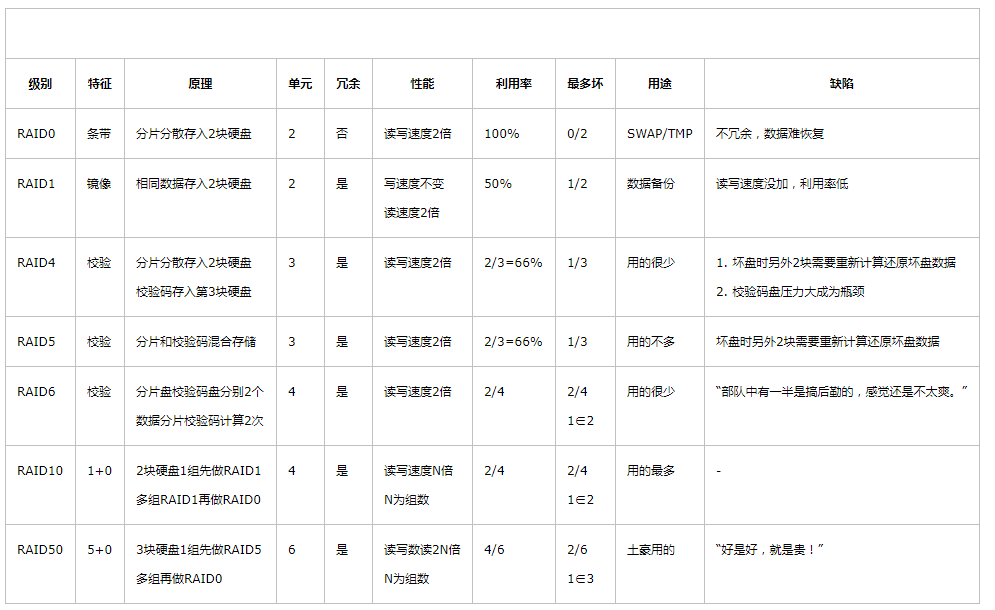

raid介绍：
=================

单盘可以配置成raid0. 也可以选择JBOD（直通模式）。

[https://www.cnblogs.com/chuncn/p/6008173.html](https://www.cnblogs.com/chuncn/p/6008173.html)  
[https://zh.wikipedia.org/wiki/RAID](https://zh.wikipedia.org/wiki/RAID)

