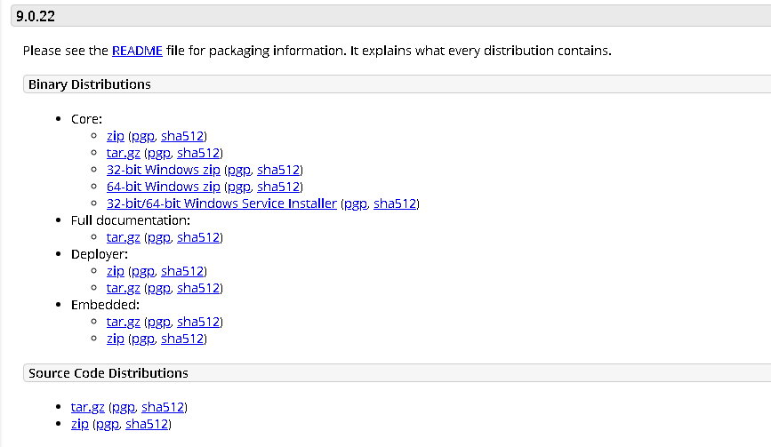

confidential
============

在apache官网下载tomcat-src版本启动，
tomcat启动成功，当时没有看到后台进程，web服务不正常。

|image0|

查看tomcat目录下的log/catalina.out发现：

::

   Could not find or load main class org.apache.catalina.startup.Bootstrap.tar

解决办法，下载Binary Distribution Core下的 zip 会自动包含 Bootstrap.tar

另外，环境变量要配置正确：

操作过程

.. code:: log

   [me@hs-es1 bin]$ $CATALINA_HOME/bin/startup.sh
   Using CATALINA_BASE:   /home/me/apache-tomcat-9.0.22
   Using CATALINA_HOME:   /home/me/apache-tomcat-9.0.22
   Using CATALINA_TMPDIR: /home/me/apache-tomcat-9.0.22/temp
   Using JRE_HOME:        /usr/lib/jvm/java-1.8.0-openjdk-1.8.0.222.b10-0.el7_6.aarch64/jre
   Using CLASSPATH:       /home/me/apache-tomcat-9.0.22/bin/bootstrap.jar:/home/me/apache-tomcat-9.0.22/bin/tomcat-juli.jar
   Tomcat started.
   [me@hs-es1 bin]$
   [me@hs-es1 bin]$
   [me@hs-es1 bin]$ nestat -antup
   bash: nestat: command not found
   [me@hs-es1 bin]$ sudo netstat -antup
   Active Internet connections (servers and established)
   Proto Recv-Q Send-Q Local Address           Foreign Address         State       PID/Program name
   tcp        0      0 127.0.0.1:25            0.0.0.0:*               LISTEN      11618/master
   tcp        0      0 0.0.0.0:111             0.0.0.0:*               LISTEN      1/systemd
   tcp        0      0 0.0.0.0:22              0.0.0.0:*               LISTEN      11263/sshd
   tcp        0      0 192.168.2.235:22        192.168.1.107:51438     ESTABLISHED 78473/sshd: root@pt
   tcp        0      0 192.168.2.235:22        192.168.1.107:51446     ESTABLISHED 78475/sshd: root@no
   tcp        0      0 192.168.2.235:22        192.168.1.107:51694     ESTABLISHED 78642/sshd: root@no
   tcp        0      0 192.168.2.235:22        192.168.1.107:51690     ESTABLISHED 78640/sshd: root@pt
   tcp6       0      0 ::1:25                  :::*                    LISTEN      11618/master
   tcp6       0      0 127.0.0.1:8005          :::*                    LISTEN      81902/java
   tcp6       0      0 :::8009                 :::*                    LISTEN      81902/java
   tcp6       0      0 :::111                  :::*                    LISTEN      1/systemd
   tcp6       0      0 :::8080                 :::*                    LISTEN      81902/java
   tcp6       0      0 :::22                   :::*                    LISTEN      11263/sshd
   udp        0      0 0.0.0.0:68              0.0.0.0:*                         

