***************************
docker iptables详解
***************************

容器ping 114
====================

主机上iptables计数清零 ::

    sudo iptables -Z

主机上使用抓包 ::

    sudo tcpdump -i docker0 icmp -w 40ping.cap

容器执行40次ping操作 ::

    ping 114.114.114.114 -c 40

导出iptables规则 ::

    sudo iptables-save -c > iptables.rules

得到抓包内容的最后4个数据包是， 抓包正常，40个数据包发出，40个数据包接收::

    77	2020-06-13 00:06:30.832927	172.17.0.2	114.114.114.114	ICMP	98	Echo (ping) request  id=0x0027, seq=39/9984, ttl=64 (reply in 78)
    78	2020-06-13 00:06:31.016522	114.114.114.114	172.17.0.2	ICMP	98	Echo (ping) reply    id=0x0027, seq=39/9984, ttl=58 (request in 77)
    79	2020-06-13 00:06:31.833406	172.17.0.2	114.114.114.114	ICMP	98	Echo (ping) request  id=0x0027, seq=40/10240, ttl=64 (reply in 80)
    80	2020-06-13 00:06:32.017020	114.114.114.114	172.17.0.2	ICMP	98	Echo (ping) reply    id=0x0027, seq=40/10240, ttl=60 (request in 79)

导出的iptables 规则如下　

::

    # Generated by iptables-save v1.6.1 on Fri Jun 12 20:18:26 2020
    *raw
    :PREROUTING ACCEPT [257:20972]
    :OUTPUT ACCEPT [111:10984]
    COMMIT
    # Completed on Fri Jun 12 20:18:26 2020
    # Generated by iptables-save v1.6.1 on Fri Jun 12 20:18:26 2020
    *mangle
    :PREROUTING ACCEPT [261:21180]
    :INPUT ACCEPT [169:12060]
    :FORWARD ACCEPT [80:6720]
    :OUTPUT ACCEPT [115:11336]
    :POSTROUTING ACCEPT [195:18056]
    COMMIT
    # Completed on Fri Jun 12 20:18:26 2020
    # Generated by iptables-save v1.6.1 on Fri Jun 12 20:18:26 2020
    *filter
    :INPUT ACCEPT [177:12476]
    :FORWARD DROP [0:0]
    :OUTPUT ACCEPT [123:12056]
    :DOCKER - [0:0]                     # 创建DOCKER链
    :DOCKER-ISOLATION-STAGE-1 - [0:0]   # 创建DOCKER-ISOLATION-STAGE-1链
    :DOCKER-ISOLATION-STAGE-2 - [0:0]   # 创建DOCKER-ISOLATION-STAGE-2链
    :DOCKER-USER - [0:0]                # 创建DOCKER-USER链
    [80:6720] -A FORWARD -j DOCKER-USER                 # 在FORWARD种插入一条规则， 所有转发链上的数据包由DOCKER-USER进行处理
    [80:6720] -A FORWARD -j DOCKER-ISOLATION-STAGE-1    # 在FORWARD种插入一条规则， 所有转发链上的数据包由DOCKER-ISOLATION-STAGE-1进行处理。 DOCKER-USER返回后，这些数据包也被匹配
    [40:3360] -A FORWARD -o docker0 -m conntrack --ctstate RELATED,ESTABLISHED -j ACCEPT # 如果从docker0转发出去，也就是来自容器的数据包， 如果是已经和已有的链接相关，或者已经建立链接则允许
    [0:0] -A FORWARD -o docker0 -j DOCKER               # 所有从docker0出去的数据包， 要经过DOCKER链处理，但是这里实际上DOCKER链是空白
    [40:3360] -A FORWARD -i docker0 ! -o docker0 -j ACCEPT  # 入接口是docker0, 出接口不是docker0的数据包允许。入接口是docker0， 意味着来自容器，出接口不是docker0， 意味着转发到其他出接口，这里是到114的数据包。
    [0:0] -A FORWARD -i docker0 -o docker0 -j ACCEPT        # 进入docker0的（目的地址是容器），而且来自容器。也就是两个容器件的数据，默认接收。但是这里是0，因为我们的simple1只往114.114.114.114发送数据包
    [40:3360] -A DOCKER-ISOLATION-STAGE-1 -i docker0 ! -o docker0 -j DOCKER-ISOLATION-STAGE-2   # 目的是容器，但是不来自容器。 也就外来数据，这里是ping的回包。
    [80:6720] -A DOCKER-ISOLATION-STAGE-1 -j RETURN                                             # DOCKER-ISOLATION-STAGE-1 返回
    [0:0] -A DOCKER-ISOLATION-STAGE-2 -o docker0 -j DROP    # DOCKER-ISOLATION-STAGE-2 ，ping的回包都来自114，所以不会被匹配。
    [40:3360] -A DOCKER-ISOLATION-STAGE-2 -j RETURN         # DOCKER-ISOLATION-STAGE-2 返回
    [80:6720] -A DOCKER-USER -j RETURN                      # DOCKER-USER 返回
    COMMIT
    # Completed on Fri Jun 12 20:18:26 2020
    # Generated by iptables-save v1.6.1 on Fri Jun 12 20:18:26 2020
    *nat
    :PREROUTING ACCEPT [14:2748]
    :INPUT ACCEPT [1:264]
    :OUTPUT ACCEPT [0:0]
    :POSTROUTING ACCEPT [0:0]
    :DOCKER - [0:0]
    [0:0] -A PREROUTING -m addrtype --dst-type LOCAL -j DOCKER              # PREROUTING链，所有目的地址是本机的数据包，都要被DOCKER链处理
    [0:0] -A OUTPUT ! -d 127.0.0.0/8 -m addrtype --dst-type LOCAL -j DOCKER # 所有主机发出的包，不是到回环地址的，但是是到本机的，都要被DOCKER链处理。容器ping 114显然不会有这些数据包
    [1:84] -A POSTROUTING -s 172.17.0.0/16 ! -o docker0 -j MASQUERADE       # POSTROUTING链上， 如果来自容器， 但是不是到容器，也就是到外部114，进行地址伪装。源地址NAT。只会匹配第一个数据包。
    [0:0] -A DOCKER -i docker0 -j RETURN                                    # docker 链返回
    COMMIT
    # Completed on Fri Jun 12 20:18:26 2020

总结转发图是

容器访问网站
======================

容器执行40次ping操作 ::

    for i in {1..2}; do curl www.baidu.com; sleep 2; done

::

    [34:7777] -A FORWARD -j DOCKER-USER
    [34:7777] -A FORWARD -j DOCKER-ISOLATION-STAGE-1
    [16:6715] -A FORWARD -o docker0 -m conntrack --ctstate RELATED,ESTABLISHED -j ACCEPT
    [0:0] -A FORWARD -o docker0 -j DOCKER
    [18:1062] -A FORWARD -i docker0 ! -o docker0 -j ACCEPT
    [0:0] -A FORWARD -i docker0 -o docker0 -j ACCEPT
    [18:1062] -A DOCKER-ISOLATION-STAGE-1 -i docker0 ! -o docker0 -j DOCKER-ISOLATION-STAGE-2
    [34:7777] -A DOCKER-ISOLATION-STAGE-1 -j RETURN
    [0:0] -A DOCKER-ISOLATION-STAGE-2 -o docker0 -j DROP
    [18:1062] -A DOCKER-ISOLATION-STAGE-2 -j RETURN
    [34:7777] -A DOCKER-USER -j RETURN
    COMMIT

    *nat
    :PREROUTING ACCEPT [19:3070]
    :INPUT ACCEPT [3:432]
    :OUTPUT ACCEPT [1:78]
    :POSTROUTING ACCEPT [1:78]
    :DOCKER - [0:0]
    [1:90] -A PREROUTING -m addrtype --dst-type LOCAL -j LOG --log-prefix "dst-type: "  # 这个是PROTO=UDP SPT=137 DPT=137，"nmbd"发送数据包，和docker无关
    [1:90] -A PREROUTING -m addrtype --dst-type LOCAL -j DOCKER
    [0:0] -A OUTPUT ! -d 127.0.0.0/8 -m addrtype --dst-type LOCAL -j DOCKER
    [4:238] -A POSTROUTING -s 172.17.0.0/16 ! -o docker0 -j MASQUERADE  # 一个curl  # 一个curl包含一个DNS请求，一个SYN请求。 2个curl所以是4个数据包
    [0:0] -A DOCKER -i docker0 -j RETURN
    COMMIT
    # Completed on Mon Jun 15 11:47:29 2020

这里和ping没有差异

容器访问容器的web服务
============================

启动nginx ::

    docker run --rm -p 8080:80 --name some-nginx
        -v /home/me/Dockerfile_kunpeng/Dockerfile_nginx/default.conf:/etc/nginx/conf.d/default.conf
        -v /home/me/Dockerfile_kunpeng:/usr/share/nginx/html:ro -d nginx

容器1执行curl ::

    curl http://172.17.0.4:80

外部访问容器的web服务
=======================

同上， 但是在另一台主机上执行curl ::

    curl http://192.168.1.180:8080

.. image:: ../images/docker_packet_flow-host_curl容器.svg

.. todo::

    为什么masquerade匹配到第一个数据包？ [#iptables_syn]_

.. [#iptables_syn] https://unix.stackexchange.com/questions/484868/in-iptables-does-masquerade-match-only-on-new-connections-syn-packets