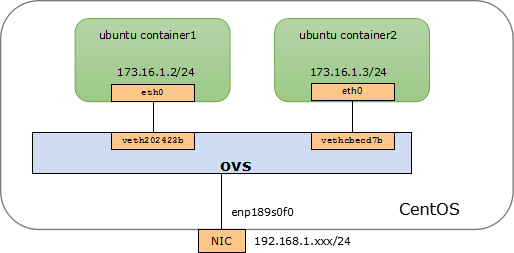
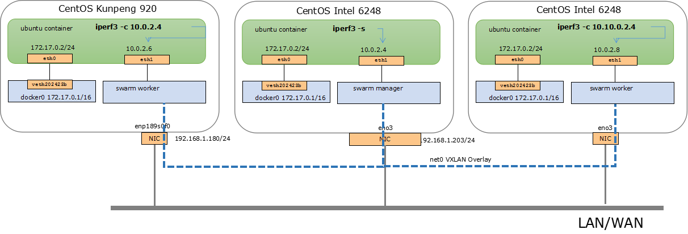
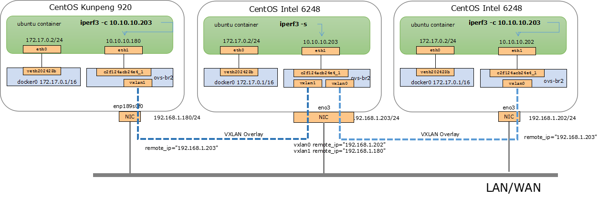

*************************
docker network
*************************

这里讨论容器网络性能。 分别在x86和ARM两种平台进行比较， arm cpu选择 kunpeng 920。x86 cpu 选择Intel 6248。
主要评价工具是iperf3。

.. csv-table:: 容器网络性能TCP对比结果
    :header: 是否跨主机, 技术, Kunpeng, Intel

    同一主机,   Docker bridge,  35Gbis/s,  25Gbit/s
    同一主机,   Open vSwitch,   51Gbitls,  32Gbit/s
    跨主机,     Docker overlay, 900Mbit/s, 876Mbit/s
    跨主机,     OVS overlay,    904Mbit/s, 880Mbit/s

Docker bridge
    安装Docker时，会创建一个网络接口，名字是docker0。docker0是一个虚拟以太网桥，用于连接容器和本地宿主网络。
    Docker会为每一个容器创建一对 veth 网络接口。
Open vSwitch
    开源虚拟交换机 ovs。虚拟交换机解决方案，同时提供内核态和用户态实现
Docker overlay
    使用Docker Swarm创建overlay网络。Docker自带的多容器跨主机通信方案。
OVS overlay
    基于OVS创建overlay网络。 多台主机上的虚拟交换机组成二层交换网络。

硬件配置 Kunpeng 920 vs Intel 6248
===================================

Kunpeng 920

.. code-block:: ini

    CPU            : Kunpeng 920-6426 2600MHz
    CPU Core       : 128
    Memory         : Samsung 2666 MT/s 32 GB * 16

    Host OS        : CentOS Linux release 7.7.1908 (AltArch)
    docker         : 19.03.8
    Container Image: Ubuntu 18.04.4 LTS
    iperf3         : 3.1.3
    Net Speed      : 1000Mb/s

Intel 6248

.. code-block:: ini

    CPU            : Intel(R) Xeon(R) Gold 6248 CPU @ 2.50GHz
    CPU Core       : 80
    Memory         : Hynix 2666 MT/s 32 GB * 16

    Host OS        : CentOS Linux release 7.7.1908
    docker         : 19.03.7
    Container Image: Ubuntu 18.04.4 LTS
    iperf3         : 3.1.3
    Net Speed      : 1000Mb/s

Docker bridge
==========================

组网模型是：

|docker_bridge|

启动容器，不做任何特殊配置

.. code-block:: shell

    docker run -itd --name container1 ubuntu /bin/bash
    docker run -itd --name container2 ubuntu /bin/bash

两台设备设置一样

.. code-block:: console

    [user1@localhost ~]$ brctl show
    bridge name     bridge id               STP enabled     interfaces
    docker0         8000.024257803194       no              vetha6c37c1
                                                            vethe61f5c0
    virbr0          8000.5254003110e8       yes             virbr0-nic
    [user1@localhost ~]$ docker ps
    CONTAINER ID        IMAGE     COMMAND       CREATED      STATUS       PORTS  NAMES
    a51cac518006        ubuntu    "/bin/bash"   2 hours ago  Up 2 hours          container2
    1726251481ee        ubuntu    "/bin/bash"   2 hours ago  Up 2 hours          container1

    apt update
    apt install -y iproute2 iputils-ping iperf3

Docker bridge Kunpeng 920 TCP：13~35Gbit/s
---------------------------------------------

Kunpeng 测试结果在13~35Gbit/s之间浮动，表现稳定

.. code-block:: console

   root@1726251481ee:/# iperf3 -c 172.17.0.3 -t 3000
   Connecting to host 172.17.0.3, port 5201
   [  4] local 172.17.0.2 port 35342 connected to 172.17.0.3 port 5201
   [ ID] Interval           Transfer     Bandwidth       Retr  Cwnd
   [  4]   0.00-1.00   sec  4.06 GBytes  34.9 Gbits/sec  1008   1011 KBytes
   [  4]   1.00-2.00   sec  4.06 GBytes  34.9 Gbits/sec    4   1.07 MBytes
   [  4]   2.00-3.00   sec  4.02 GBytes  34.5 Gbits/sec    6   1.15 MBytes
   [  4]   3.00-4.00   sec  4.04 GBytes  34.7 Gbits/sec    0   1.21 MBytes
   [  4]   4.00-5.00   sec  4.02 GBytes  34.5 Gbits/sec    0   1.29 MBytes
   [  4]   5.00-6.00   sec  4.02 GBytes  34.5 Gbits/sec    0   1.37 MBytes
   [  4]   6.00-7.00   sec  4.04 GBytes  34.7 Gbits/sec    0   1.42 MBytes
   [  4]   7.00-8.00   sec  4.09 GBytes  35.1 Gbits/sec    0   1.47 MBytes
   [  4]   8.00-9.00   sec  3.57 GBytes  30.7 Gbits/sec    0   1.53 MBytes
   [  4]   9.00-10.00  sec  2.33 GBytes  20.0 Gbits/sec    0   1.57 MBytes
   [  4]  10.00-11.00  sec  1.60 GBytes  13.8 Gbits/sec   90   1.22 MBytes
   [  4]  11.00-12.00  sec  2.42 GBytes  20.8 Gbits/sec    0   1.32 MBytes
   [  4]  12.00-13.00  sec  1.92 GBytes  16.5 Gbits/sec    0   1.40 MBytes
   [  4]  13.00-14.00  sec  1.66 GBytes  14.2 Gbits/sec    0   1.47 MBytes
   [  4]  14.00-15.00  sec  1.84 GBytes  15.8 Gbits/sec    0   1.51 MBytes
   [  4]  15.00-16.00  sec  1.79 GBytes  15.4 Gbits/sec    0   1.54 MBytes
   [  4]  16.00-17.00  sec  3.59 GBytes  30.9 Gbits/sec   91   1.12 MBytes
   [  4]  17.00-18.00  sec  4.12 GBytes  35.4 Gbits/sec   45    899 KBytes
   [  4]  18.00-19.00  sec  4.14 GBytes  35.5 Gbits/sec    0    994 KBytes
   [  4]  19.00-20.00  sec  4.11 GBytes  35.3 Gbits/sec    0   1.06 MBytes
   [  4]  20.00-21.00  sec  4.15 GBytes  35.7 Gbits/sec    0   1.12 MBytes
   [  4]  21.00-22.00  sec  4.15 GBytes  35.7 Gbits/sec    0   1.19 MBytes

Docker bridge Intel 6248 25Gbit/s
------------------------------------

Intel的测试结果稳定在25Gbit/s左右

.. code-block:: console

    root@3c7da2e893b8:/# iperf3 -c 172.17.0.2 -t 3000
    Connecting to host 172.17.0.2, port 5201
    [  4] local 172.17.0.3 port 48094 connected to 172.17.0.2 port 5201
    [ ID] Interval           Transfer     Bandwidth       Retr  Cwnd
    [  4]   0.00-1.00   sec  2.50 GBytes  21.5 Gbits/sec  135    321 KBytes
    [  4]   1.00-2.00   sec  2.94 GBytes  25.3 Gbits/sec    0    321 KBytes
    [  4]   2.00-3.00   sec  2.95 GBytes  25.4 Gbits/sec    0    321 KBytes
    [  4]   3.00-4.00   sec  2.95 GBytes  25.3 Gbits/sec    0    321 KBytes
    [  4]   4.00-5.00   sec  2.95 GBytes  25.3 Gbits/sec    0    321 KBytes
    [  4]   5.00-6.00   sec  2.63 GBytes  22.6 Gbits/sec  631    230 KBytes
    [  4]   6.00-7.00   sec  2.67 GBytes  23.0 Gbits/sec    0    232 KBytes
    [  4]   7.00-8.00   sec  2.85 GBytes  24.5 Gbits/sec    0    341 KBytes
    [  4]   8.00-9.00   sec  2.88 GBytes  24.8 Gbits/sec    0    341 KBytes
    [  4]   9.00-10.00  sec  2.79 GBytes  24.0 Gbits/sec    0    345 KBytes
    [  4]  10.00-11.00  sec  2.96 GBytes  25.4 Gbits/sec    0    345 KBytes
    [  4]  11.00-12.00  sec  2.87 GBytes  24.6 Gbits/sec    0    352 KBytes
    [  4]  12.00-13.00  sec  2.84 GBytes  24.4 Gbits/sec    0    361 KBytes
    [  4]  13.00-14.00  sec  2.68 GBytes  23.0 Gbits/sec  532    221 KBytes
    [  4]  14.00-15.00  sec  2.61 GBytes  22.4 Gbits/sec    0    221 KBytes
    [  4]  15.00-16.00  sec  2.66 GBytes  22.8 Gbits/sec    0    376 KBytes
    [  4]  16.00-17.00  sec  2.63 GBytes  22.6 Gbits/sec    0    376 KBytes
    [  4]  17.00-18.00  sec  2.75 GBytes  23.7 Gbits/sec    0    376 KBytes
    [  4]  18.00-19.00  sec  2.46 GBytes  21.1 Gbits/sec    0    376 KBytes
    [  4]  19.00-20.00  sec  2.96 GBytes  25.4 Gbits/sec    0    376 KBytes
    [  4]  20.00-21.00  sec  2.51 GBytes  21.5 Gbits/sec    0    376 KBytes
    [  4]  21.00-22.00  sec  2.87 GBytes  24.7 Gbits/sec    0    376 KBytes
    [  4]  22.00-23.00  sec  2.80 GBytes  24.0 Gbits/sec    0    400 KBytes
    [  4]  23.00-24.00  sec  2.88 GBytes  24.7 Gbits/sec    0    403 KBytes
    [  4]  24.00-25.00  sec  2.85 GBytes  24.5 Gbits/sec  125    290 KBytes

原因分析： iperf3的进程在Kunpeng上频繁核间迁移，在intel上较固定
---------------------------------------------------------------

.. code-block:: console
    :caption: Kunpeng iperf3进程分布

    1  [               0.0%]   33 [               0.0%]   65 [               0.0%]   97 [      0.0%]
    2  [||             2.6%]   34 [               0.0%]   66 [               0.0%]   98 [      0.0%]
    3  [|              1.3%]   35 [               0.0%]   67 [               0.0%]   99 [      0.0%]
    4  [               0.0%]   36 [               0.0%]   68 [               0.0%]   100[      0.0%]
    5  [||||||        31.0%]   37 [               0.0%]   69 [               0.0%]   101[      0.0%]
    6  [|||||||||||   51.9%]   38 [               0.0%]   70 [               0.0%]   102[      0.0%]
    7  [|||           11.0%]   39 [               0.0%]   71 [               0.0%]   103[      0.0%]
    8  [               0.0%]   40 [               0.0%]   72 [               0.0%]   104[      0.0%]
    9  [               0.0%]   41 [               0.0%]   73 [               0.0%]   105[      0.0%]
    10 [               0.0%]   42 [               0.0%]   74 [               0.0%]   106[      0.0%]
    11 [               0.0%]   43 [               0.0%]   75 [               0.0%]   107[      0.0%]
    12 [               0.0%]   44 [               0.0%]   76 [               0.0%]   108[      0.0%]
    13 [               0.0%]   45 [               0.0%]   77 [               0.0%]   109[      0.0%]
    14 [               0.0%]   46 [               0.0%]   78 [               0.0%]   110[      0.0%]
    15 [               0.0%]   47 [               0.0%]   79 [               0.0%]   111[      0.0%]
    16 [               0.0%]   48 [               0.0%]   80 [               0.0%]   112[      0.0%]
    17 [               0.0%]   49 [               0.0%]   81 [               0.0%]   113[      0.0%]
    18 [               0.0%]   50 [               0.0%]   82 [               0.0%]   114[      0.0%]
    19 [               0.0%]   51 [               0.0%]   83 [               0.0%]   115[      0.0%]
    20 [               0.0%]   52 [               0.0%]   84 [               0.0%]   116[      0.0%]
    21 [               0.0%]   53 [               0.0%]   85 [               0.0%]   117[      0.0%]
    22 [               0.0%]   54 [               0.0%]   86 [|||||||       32.9%]   118[      0.0%]
    23 [               0.0%]   55 [               0.0%]   87 [|||            6.5%]   119[      0.0%]
    24 [               0.0%]   56 [               0.0%]   88 [||||          18.8%]   120[      0.0%]
    25 [               0.0%]   57 [               0.0%]   89 [|              3.2%]   121[      0.0%]
    26 [               0.0%]   58 [               0.0%]   90 [|              3.3%]   122[      0.0%]
    27 [               0.0%]   59 [               0.0%]   91 [||||||        31.2%]   123[      0.0%]
    28 [               0.0%]   60 [               0.0%]   92 [|              2.6%]   124[      0.0%]
    29 [               0.0%]   61 [               0.0%]   93 [               0.0%]   125[      0.0%]
    30 [               0.0%]   62 [               0.0%]   94 [               0.0%]   126[      0.0%]
    31 [               0.0%]   63 [               0.0%]   95 [               0.0%]   127[      0.0%]
    32 [               0.0%]   64 [               0.0%]   96 [               0.0%]   128[      0.0%]
    Mem[||||                                11.6G/511G]   Tasks: 64, 288 thr; 3 running
    Swp[                                      0K/4.00G]   Load average: 1.01 0.53 0.36

.. code-block:: console
    :caption: Intel iperf3进程分布

    1  [|           4.7%]   21 [||||||||||100.0%]   41 [            0.0%]   61 [            0.0%]
    2  [            0.0%]   22 [|||||||||||90.0%]   42 [            0.0%]   62 [            0.0%]
    3  [            0.0%]   23 [            0.0%]   43 [            0.0%]   63 [||          2.0%]
    4  [            0.0%]   24 [            0.0%]   44 [            0.0%]   64 [            0.0%]
    5  [            0.0%]   25 [            0.0%]   45 [            0.0%]   65 [            0.0%]
    6  [            0.0%]   26 [            0.0%]   46 [            0.0%]   66 [            0.0%]
    7  [            0.0%]   27 [            0.0%]   47 [            0.0%]   67 [            0.0%]
    8  [            0.0%]   28 [            0.0%]   48 [            0.0%]   68 [            0.0%]
    9  [            0.0%]   29 [            0.0%]   49 [            0.0%]   69 [            0.0%]
    10 [            0.0%]   30 [            0.0%]   50 [            0.0%]   70 [            0.0%]
    11 [            0.0%]   31 [            0.0%]   51 [            0.0%]   71 [            0.0%]
    12 [            0.0%]   32 [|           0.6%]   52 [            0.0%]   72 [            0.0%]
    13 [            0.0%]   33 [            0.0%]   53 [            0.0%]   73 [            0.0%]
    14 [            0.0%]   34 [            0.0%]   54 [            0.0%]   74 [            0.0%]
    15 [            0.0%]   35 [|           0.6%]   55 [            0.0%]   75 [            0.0%]
    16 [            0.0%]   36 [            0.0%]   56 [            0.0%]   76 [            0.0%]
    17 [            0.0%]   37 [            0.0%]   57 [            0.0%]   77 [            0.0%]
    18 [            0.0%]   38 [            0.0%]   58 [            0.0%]   78 [            0.0%]
    19 [            0.0%]   39 [            0.0%]   59 [            0.0%]   79 [            0.0%]
    20 [            0.0%]   40 [            0.0%]   60 [            0.0%]   80 [            0.0%]
    Mem[|||                           4.62G/503G]   Tasks: 69, 337 thr; 3 running
    Swp[                                0K/4.00G]   Load average: 0.39 0.15 0.14
                                                    Uptime: 1 day, 02:20:37

在Kunpengs进行绑核操作后测试， 结果稳定在35Gbit/s左右

.. code-block:: shell

    taskset -cp 0 33802
    taskset -cp 1 33022

.. code-block:: console

    [root@localhost user1]# taskset -cp 0 39081
    pid 39081's current affinity list: 0-127
    pid 39081's new affinity list: 0
    [root@localhost user1]# taskset -cp 1 39082
    pid 39082's current affinity list: 0
    pid 39082's new affinity list: 1
    [root@localhost user1]#

.. code-block:: console

    [  4] 149.00-150.00 sec  4.06 GBytes  34.8 Gbits/sec    0   3.00 MBytes
    [  4] 150.00-151.00 sec  4.04 GBytes  34.7 Gbits/sec    0   3.00 MBytes
    [  4] 151.00-152.00 sec  4.07 GBytes  35.0 Gbits/sec    0   3.00 MBytes
    [  4] 152.00-153.00 sec  4.10 GBytes  35.2 Gbits/sec    0   3.00 MBytes
    [  4] 153.00-154.00 sec  4.08 GBytes  35.0 Gbits/sec    0   3.00 MBytes
    [  4] 154.00-155.00 sec  4.07 GBytes  35.0 Gbits/sec    0   3.00 MBytes
    [  4] 155.00-156.00 sec  4.09 GBytes  35.1 Gbits/sec    0   3.00 MBytes
    [  4] 156.00-157.00 sec  3.91 GBytes  33.6 Gbits/sec    0   3.00 MBytes
    [  4] 157.00-158.00 sec  4.06 GBytes  34.8 Gbits/sec    0   3.00 MBytes
    [  4] 158.00-159.00 sec  4.07 GBytes  35.0 Gbits/sec    0   3.00 MBytes
    [  4] 159.00-160.00 sec  4.07 GBytes  34.9 Gbits/sec    0   3.00 MBytes
    [  4] 160.00-161.00 sec  4.08 GBytes  35.0 Gbits/sec    0   3.00 MBytes
    [  4] 161.00-162.00 sec  4.09 GBytes  35.2 Gbits/sec    0   3.00 MBytes
    [  4] 162.00-163.00 sec  4.06 GBytes  34.9 Gbits/sec    0   3.00 MBytes

OVS(open vswitch)
==========================

ovs的安装运行查看 :doc:`ovs` 。

组网模型：

|ovs_bridge|

创建ovs虚拟交换机， 添加接口到容器A和容器B内，使用iperf3进行测试。 [#ovs_docker]_ [#IBM_ovs_docker]_

.. code-block:: shell

    ovs-vsctl add-br ovs-br1
    ip addr add 173.16.1.1/24 dev ovs-br1
    ovs-docker add-port ovs-br1 eth1 containerA --ipaddress=173.16.1.2/24
    ovs-docker add-port ovs-br1 eth1 containerB --ipaddress=173.16.1.3/24

容器安装必要工具

.. code-block:: shell

    apt install -y iproute2 iputils-ping iperf3

测试命令：

.. code-block:: shell

    iperf3 -s                       #在服务端 173.16.1.2
    iperf3 -c 173.16.1.3 -t 30000   #在客户端

OVS brige Kunpeng TCP：51Gbit/s
---------------------------------

未绑核的情况带宽是比较低的， 绑核后获得大幅度提升。 同时可以看到ovs的性能要比linux的vswitch好。

.. code-block:: console

    [  4] 113.00-114.00 sec  1.88 GBytes  16.1 Gbits/sec    0   1.29 MBytes
    [  4] 114.00-115.00 sec  2.15 GBytes  18.5 Gbits/sec    0   1.33 MBytes
    [  4] 115.00-116.00 sec  2.24 GBytes  19.2 Gbits/sec    0   1.35 MBytes
    [  4] 116.00-117.00 sec  2.34 GBytes  20.1 Gbits/sec    0   1.42 MBytes
    [  4] 117.00-118.00 sec  2.29 GBytes  19.7 Gbits/sec    0   1.55 MBytes
    [  4] 118.00-119.00 sec  2.26 GBytes  19.4 Gbits/sec    0   1.72 MBytes
    [  4] 119.00-120.00 sec  5.26 GBytes  45.2 Gbits/sec    0   1.89 MBytes
    [  4] 120.00-121.00 sec  5.26 GBytes  45.2 Gbits/sec    0   2.10 MBytes
    [  4] 121.00-122.00 sec  3.08 GBytes  26.5 Gbits/sec    2   2.34 MBytes
    [  4] 122.00-123.00 sec  5.43 GBytes  46.7 Gbits/sec    2   2.35 MBytes
    [  4] 123.00-124.00 sec  4.62 GBytes  39.7 Gbits/sec    0   2.36 MBytes
    [  4] 124.00-125.00 sec  5.61 GBytes  48.2 Gbits/sec    0   2.36 MBytes
    [  4] 125.00-126.00 sec  6.16 GBytes  52.9 Gbits/sec    0   2.37 MBytes
    [  4] 126.00-127.00 sec  5.68 GBytes  48.8 Gbits/sec    0   2.40 MBytes
    [  4] 127.00-128.00 sec  6.10 GBytes  52.4 Gbits/sec    0   2.42 MBytes
    [  4] 128.00-129.00 sec  5.76 GBytes  49.5 Gbits/sec    0   2.49 MBytes
    [  4] 129.00-130.00 sec  5.96 GBytes  51.2 Gbits/sec    0   2.54 MBytes
    [  4] 130.00-131.00 sec  5.96 GBytes  51.2 Gbits/sec  136   1.89 MBytes

OVS bridge Intel TCP：32Gbit/s
--------------------------------

.. code-block:: console

    [  4]  20.00-21.00  sec  3.73 GBytes  32.0 Gbits/sec    0    378 KBytes
    [  4]  21.00-22.00  sec  3.45 GBytes  29.7 Gbits/sec    0    427 KBytes
    [  4]  22.00-23.00  sec  3.30 GBytes  28.4 Gbits/sec    0    427 KBytes
    [  4]  23.00-24.00  sec  3.59 GBytes  30.8 Gbits/sec    0    427 KBytes
    [  4]  24.00-25.00  sec  3.70 GBytes  31.8 Gbits/sec    0    427 KBytes
    [  4]  25.00-26.00  sec  3.50 GBytes  30.1 Gbits/sec    0    427 KBytes
    [  4]  26.00-27.00  sec  3.32 GBytes  28.5 Gbits/sec    0    427 KBytes
    [  4]  27.00-28.00  sec  3.67 GBytes  31.5 Gbits/sec    0    458 KBytes
    [  4]  28.00-29.00  sec  3.75 GBytes  32.2 Gbits/sec    0    458 KBytes
    [  4]  29.00-30.00  sec  3.55 GBytes  30.5 Gbits/sec    0    458 KBytes
    [  4]  30.00-31.00  sec  3.69 GBytes  31.7 Gbits/sec    0    465 KBytes
    [  4]  31.00-32.00  sec  3.52 GBytes  30.2 Gbits/sec    0    465 KBytes
    [  4]  32.00-33.00  sec  3.61 GBytes  31.0 Gbits/sec    0    465 KBytes
    [  4]  33.00-34.00  sec  3.53 GBytes  30.3 Gbits/sec    0    465 KBytes

Docker overlay
=======================

Docker overlay的组网模型是：

|docker_overlay|

使用docker swarm创建manager和worker关系， 创建一个net0的overlay网络，三台主机上分别运行ubuntu容器，
需要指定容器运行的网络为net0.

创建docker自带的overlay网络，中间可能会遇到问题，如果涉及firewalld和dockerd的重启话，最好重启一下设备。

向overlay网络添加容器，并进行测试。

host1的操作

.. code-block:: shell

    docker network create --driver overlay --attachable net0
    docker run -itd --name ubuntu1 --network net0 ubuntux86
    docker exec -it ubuntu1 bash
    iperf3 -s

host2的操作

.. code-block:: shell

    docker run -itd --name ubuntu2 --network net0 ubuntux86
    docker exec -it ubuntu2 bash
    iperf3 -c 10.0.2.4
    iperf3 -u -c 10.0.2.4 -b 920M

Docker overlay Kunpeng 920 TCP: 900Mbit/s UDP:920Mbit/s
-----------------------------------------------------------

Docker overlay Kunpeng 920 TCP测试结果：900Mbit/s

.. code-block:: console

    root@47bc82102ad2:/# iperf3 -s
    -----------------------------------------------------------
    Server listening on 5201
    -----------------------------------------------------------
    Accepted connection from 10.0.2.4, port 34312
    [  5] local 10.0.2.8 port 5201 connected to 10.0.2.4 port 34314
    [ ID] Interval           Transfer     Bandwidth
    [  5]   0.00-1.00   sec   104 MBytes   875 Mbits/sec
    [  5]   1.00-2.00   sec   108 MBytes   909 Mbits/sec
    [  5]   2.00-3.00   sec   108 MBytes   909 Mbits/sec
    [  5]   3.00-4.00   sec   108 MBytes   909 Mbits/sec
    [  5]   4.00-5.00   sec   108 MBytes   908 Mbits/sec
    [  5]   5.00-6.00   sec   106 MBytes   885 Mbits/sec
    [  5]   6.00-7.00   sec   107 MBytes   899 Mbits/sec
    [  5]   7.00-8.00   sec   108 MBytes   909 Mbits/sec
    [  5]   8.00-9.00   sec   106 MBytes   888 Mbits/sec
    [  5]   9.00-10.00  sec   108 MBytes   909 Mbits/sec
    [  5]  10.00-10.05  sec  5.32 MBytes   908 Mbits/sec
    - - - - - - - - - - - - - - - - - - - - - - - - -
    [ ID] Interval           Transfer     Bandwidth
    [  5]   0.00-10.05  sec  0.00 Bytes  0.00 bits/sec                  sender
    [  5]   0.00-10.05  sec  1.05 GBytes   900 Mbits/sec                  receiver
    -----------------------------------------------------------
    Server listening on 5201
    -----------------------------------------------------------

Docker overlay Kunpeng 920 UDP测试结果：910Mbit/s

.. code-block:: console

    Accepted connection from 10.0.2.4, port 34444
    [  5] local 10.0.2.8 port 5201 connected to 10.0.2.4 port 49708
    [ ID] Interval           Transfer     Bandwidth       Jitter    Lost/Total Datagrams
    [  5]   0.00-1.00   sec  93.6 MBytes   785 Mbits/sec  0.056 ms  383/12364 (3.1%)
    [  5]   1.00-2.00   sec   109 MBytes   912 Mbits/sec  0.056 ms  0/13921 (0%)
    [  5]   2.00-3.00   sec   109 MBytes   910 Mbits/sec  0.059 ms  0/13890 (0%)
    [  5]   3.00-4.00   sec   108 MBytes   910 Mbits/sec  0.058 ms  0/13881 (0%)
    [  5]   4.00-5.00   sec   108 MBytes   910 Mbits/sec  0.058 ms  0/13886 (0%)
    [  5]   5.00-6.00   sec   108 MBytes   910 Mbits/sec  0.057 ms  0/13885 (0%)
    [  5]   6.00-7.00   sec   108 MBytes   910 Mbits/sec  0.057 ms  0/13886 (0%)
    [  5]   7.00-8.00   sec   107 MBytes   900 Mbits/sec  0.055 ms  0/13736 (0%)
    [  5]   8.00-9.00   sec   109 MBytes   914 Mbits/sec  0.056 ms  95/14038 (0.68%)
    [  5]   9.00-10.00  sec   108 MBytes   910 Mbits/sec  0.056 ms  0/13886 (0%)
    [  5]  10.00-10.04  sec  4.12 MBytes   884 Mbits/sec  4.247 ms  0/527 (0%)
    - - - - - - - - - - - - - - - - - - - - - - - - -
    [ ID] Interval           Transfer     Bandwidth       Jitter    Lost/Total Datagrams
    [  5]   0.00-10.04  sec  0.00 Bytes  0.00 bits/sec  4.247 ms  478/137900 (0.35%)

Docker overlay Intel 6248 TCP: 876Mbit/s UDP: 920Mbit/s
---------------------------------------------------------------

Docker overlay Intel 6248 TCP测试结果：870Mbit/s

.. code-block:: console

    -----------------------------------------------------------
    Server listening on 5201
    -----------------------------------------------------------
    Accepted connection from 10.0.2.6, port 35886
    [  5] local 10.0.2.4 port 5201 connected to 10.0.2.6 port 35888
    [ ID] Interval           Transfer     Bandwidth
    [  5]   0.00-1.00   sec   103 MBytes   861 Mbits/sec
    [  5]   1.00-2.00   sec   106 MBytes   889 Mbits/sec
    [  5]   2.00-3.00   sec   105 MBytes   879 Mbits/sec
    [  5]   3.00-4.00   sec   106 MBytes   887 Mbits/sec
    [  5]   4.00-5.00   sec   105 MBytes   878 Mbits/sec
    [  5]   5.00-6.00   sec   104 MBytes   871 Mbits/sec
    [  5]   6.00-7.00   sec   105 MBytes   881 Mbits/sec
    [  5]   7.00-8.00   sec   104 MBytes   873 Mbits/sec
    [  5]   8.00-9.00   sec   104 MBytes   876 Mbits/sec
    [  5]   9.00-10.00  sec   103 MBytes   866 Mbits/sec
    [  5]  10.00-10.04  sec  3.74 MBytes   850 Mbits/sec
    - - - - - - - - - - - - - - - - - - - - - - - - -
    [ ID] Interval           Transfer     Bandwidth
    [  5]   0.00-10.04  sec  0.00 Bytes  0.00 bits/sec                  sender
    [  5]   0.00-10.04  sec  1.02 GBytes   876 Mbits/sec                  receiver
    -----------------------------------------------------------
    Server listening on 5201
    -----------------------------------------------------------

Docker overlay Intel 6248 UDP测试结果：920Mbit/s

.. code-block:: console

    -----------------------------------------------------------
    Server listening on 5201
    -----------------------------------------------------------
    Accepted connection from 10.0.2.6, port 35926
    [  5] local 10.0.2.4 port 5201 connected to 10.0.2.6 port 41926
    [ ID] Interval           Transfer     Bandwidth       Jitter    Lost/Total Datagrams
    [  5]   0.00-1.00   sec  94.8 MBytes   795 Mbits/sec  0.068 ms  61/12189 (0.5%)
    [  5]   1.00-2.00   sec   110 MBytes   926 Mbits/sec  0.069 ms  8/14136 (0.057%)
    [  5]   2.00-3.00   sec   110 MBytes   920 Mbits/sec  0.070 ms  0/14031 (0%)
    [  5]   3.00-4.00   sec   110 MBytes   921 Mbits/sec  0.069 ms  0/14047 (0%)
    [  5]   4.00-5.00   sec   110 MBytes   921 Mbits/sec  0.069 ms  0/14046 (0%)
    [  5]   5.00-6.00   sec   110 MBytes   919 Mbits/sec  0.067 ms  6/14029 (0.043%)
    [  5]   6.00-7.00   sec   110 MBytes   920 Mbits/sec  0.069 ms  0/14039 (0%)
    [  5]   7.00-8.00   sec   110 MBytes   919 Mbits/sec  0.068 ms  0/14026 (0%)
    [  5]   8.00-9.00   sec   110 MBytes   920 Mbits/sec  0.068 ms  0/14042 (0%)
    [  5]   9.00-10.00  sec   110 MBytes   920 Mbits/sec  0.070 ms  0/14045 (0%)
    [  5]  10.00-10.04  sec  4.27 MBytes   925 Mbits/sec  0.067 ms  0/547 (0%)
    - - - - - - - - - - - - - - - - - - - - - - - - -
    [ ID] Interval           Transfer     Bandwidth       Jitter    Lost/Total Datagrams
    [  5]   0.00-10.04  sec  0.00 Bytes  0.00 bits/sec  0.067 ms  75/139177 (0.054%)

OVS overlay
==========================

overlay组网模型是：

|ovs_overlay|

以一台Intel 6248座位服务器， Kunepng和另一台 Intel 6248上的容器， 通过OVS的overlay网络进行链接。

注意在服务端和客户端主机上添加ovs的转发规则：

.. code-block:: console

    [root@centos86 user1]# ovs-ofctl dump-flows ovs-br2
    NXST_FLOW reply (xid=0x4):
    cookie=0x0, duration=58541.701s, table=0, n_packets=97516, n_bytes=6504861, idle_age=57619, dl_dst=66:54:7a:62:b6:10 actions=output:1
    cookie=0x0, duration=58405.390s, table=0, n_packets=13621374, n_bytes=20082918183, idle_age=57619, dl_src=66:54:7a:62:b6:10 actions=output:8
    cookie=0x0, duration=232287.907s, table=0, n_packets=218038, n_bytes=17877238, idle_age=65534, hard_age=65534, priority=1,in_port=8 actions=output:3
    cookie=0x0, duration=232279.101s, table=0, n_packets=12857841, n_bytes=18850928879, idle_age=65534, hard_age=65534, priority=1,in_port=3 actions=output:8

测试命令是：

.. code-block:: shell

    iperf3 -s -p 3333
    iperf3 -c 10.10.10.203 -p 3333
    iperf3 -u -c 10.10.10.203 -p 3333 -b 800M -t 3000

OVS overlay Kunpeng 920 TCP：904Mbit/s UDP：800Mbit/s
-------------------------------------------------------------

OVS overlay Kunpeng 920 TCP测试结果：904Mbit/s

.. code-block:: console

    root@774b2f613874:/# iperf3 -s -p 3333
    -----------------------------------------------------------
    Server listening on 3333
    -----------------------------------------------------------
    Accepted connection from 10.10.10.180, port 53102
    [  5] local 10.10.10.203 port 3333 connected to 10.10.10.180 port 53104
    [ ID] Interval           Transfer     Bandwidth
    [  5]   0.00-1.00   sec   103 MBytes   868 Mbits/sec
    [  5]   1.00-2.00   sec   108 MBytes   909 Mbits/sec
    [  5]   2.00-3.00   sec   108 MBytes   909 Mbits/sec
    [  5]   3.00-4.00   sec   108 MBytes   909 Mbits/sec
    [  5]   4.00-5.00   sec   108 MBytes   909 Mbits/sec
    [  5]   5.00-6.00   sec   108 MBytes   909 Mbits/sec
    [  5]   6.00-7.00   sec   108 MBytes   909 Mbits/sec
    [  5]   7.00-8.00   sec   108 MBytes   909 Mbits/sec
    [  5]   8.00-9.00   sec   108 MBytes   906 Mbits/sec
    [  5]   9.00-10.00  sec   108 MBytes   909 Mbits/sec
    [  5]  10.00-10.04  sec  4.03 MBytes   908 Mbits/sec
    - - - - - - - - - - - - - - - - - - - - - - - - -
    [ ID] Interval           Transfer     Bandwidth
    [  5]   0.00-10.04  sec  0.00 Bytes  0.00 bits/sec                  sender
    [  5]   0.00-10.04  sec  1.06 GBytes   904 Mbits/sec                  receiver
    -----------------------------------------------------------

OVS overlay Kunpeng 920 UDP测试结果：800Mbit/s

.. code-block:: console

    Accepted connection from 10.10.10.180, port 53114
    [  5] local 10.10.10.203 port 3333 connected to 10.10.10.180 port 48230
    [ ID] Interval           Transfer     Bandwidth       Jitter    Lost/Total Datagrams
    [  5]   0.00-1.00   sec  87.1 MBytes   731 Mbits/sec  0.061 ms  0/11152 (0%)
    [  5]   1.00-2.00   sec  93.8 MBytes   787 Mbits/sec  0.063 ms  0/12004 (0%)
    [  5]   2.00-3.00   sec  97.7 MBytes   820 Mbits/sec  0.057 ms  0/12510 (0%)
    [  5]   3.00-4.00   sec  98.2 MBytes   824 Mbits/sec  0.063 ms  0/12570 (0%)
    [  5]   4.00-5.00   sec  91.6 MBytes   768 Mbits/sec  0.051 ms  15/11740 (0.13%)
    [  5]   5.00-6.00   sec  97.0 MBytes   814 Mbits/sec  0.056 ms  0/12418 (0%)
    [  5]   6.00-7.00   sec  95.8 MBytes   804 Mbits/sec  0.060 ms  0/12261 (0%)
    [  5]   7.00-8.00   sec  95.7 MBytes   803 Mbits/sec  0.059 ms  0/12252 (0%)
    [  5]   8.00-9.00   sec  91.8 MBytes   770 Mbits/sec  0.059 ms  0/11751 (0%)
    [  5]   9.00-10.00  sec  97.3 MBytes   817 Mbits/sec  0.053 ms  0/12460 (0%)
    [  5]  10.00-11.00  sec  96.9 MBytes   813 Mbits/sec  0.056 ms  0/12406 (0%)
    [  5]  11.00-12.00  sec  96.3 MBytes   808 Mbits/sec  0.060 ms  0/12326 (0%)
    [  5]  12.00-13.00  sec  94.1 MBytes   789 Mbits/sec  0.061 ms  0/12041 (0%)
    [  5]  13.00-14.00  sec  90.7 MBytes   761 Mbits/sec  0.057 ms  0/11605 (0%)
    [  5]  14.00-15.00  sec   101 MBytes   848 Mbits/sec  0.062 ms  0/12946 (0%)

OVS overlay Intel 6248 TCP: 880Mbit/s UDP: 730Mbit/s
----------------------------------------------------------

测试命令

.. code-block:: console

    iperf3 -s -p 3333
    iperf3 -c 10.10.10.203 -p 3333
    iperf3 -u -c 10.10.10.203 -p 3333 -b 750M -t 3000

OVS overlay Intel 6248 TCP测试结果:

.. code-block:: console

    Accepted connection from 10.10.10.202, port 57518
    [  5] local 10.10.10.203 port 3333 connected to 10.10.10.202 port 57520
    [ ID] Interval           Transfer     Bandwidth
    [  5]   0.00-1.00   sec   101 MBytes   844 Mbits/sec
    [  5]   1.00-2.00   sec   104 MBytes   876 Mbits/sec
    [  5]   2.00-3.00   sec   105 MBytes   878 Mbits/sec
    [  5]   3.00-4.00   sec   105 MBytes   880 Mbits/sec
    [  5]   4.00-5.00   sec   106 MBytes   886 Mbits/sec
    [  5]   5.00-6.00   sec   105 MBytes   883 Mbits/sec
    [  5]   6.00-7.00   sec   107 MBytes   896 Mbits/sec
    [  5]   7.00-8.00   sec   105 MBytes   882 Mbits/sec
    [  5]   8.00-9.00   sec   106 MBytes   892 Mbits/sec
    [  5]   9.00-10.00  sec   106 MBytes   890 Mbits/sec
    [  5]  10.00-10.03  sec  3.53 MBytes   893 Mbits/sec
    - - - - - - - - - - - - - - - - - - - - - - - - -
    [ ID] Interval           Transfer     Bandwidth
    [  5]   0.00-10.03  sec  0.00 Bytes  0.00 bits/sec                  sender
    [  5]   0.00-10.03  sec  1.03 GBytes   881 Mbits/sec                  receiver

OVS overlay Kunpeng 920 UDP测试结果

.. code-block:: console

    Accepted connection from 10.10.10.202, port 57546
    [  5] local 10.10.10.203 port 3333 connected to 10.10.10.202 port 47677
    [ ID] Interval           Transfer     Bandwidth       Jitter    Lost/Total Datagrams
    [  5]   0.00-1.00   sec  78.8 MBytes   661 Mbits/sec  0.067 ms  72/10153 (0.71%)
    [  5]   1.00-2.00   sec  89.2 MBytes   749 Mbits/sec  0.068 ms  0/11422 (0%)
    [  5]   2.00-3.00   sec  87.5 MBytes   734 Mbits/sec  0.069 ms  240/11435 (2.1%)
    [  5]   3.00-4.00   sec  87.4 MBytes   733 Mbits/sec  0.070 ms  253/11444 (2.2%)
    [  5]   4.00-5.00   sec  87.3 MBytes   732 Mbits/sec  0.066 ms  269/11443 (2.4%)
    [  5]   5.00-6.00   sec  87.3 MBytes   732 Mbits/sec  0.065 ms  273/11444 (2.4%)
    [  5]   6.00-7.00   sec  87.3 MBytes   732 Mbits/sec  0.065 ms  274/11445 (2.4%)
    [  5]   7.00-8.00   sec  87.2 MBytes   732 Mbits/sec  0.066 ms  281/11444 (2.5%)
    [  5]   8.00-9.00   sec  87.2 MBytes   732 Mbits/sec  0.065 ms  280/11443 (2.4%)
    [  5]   9.00-10.00  sec  87.2 MBytes   732 Mbits/sec  0.066 ms  278/11444 (2.4%)
    [  5]  10.00-11.00  sec  87.2 MBytes   731 Mbits/sec  0.069 ms  285/11445 (2.5%)
    [  5]  11.00-12.00  sec  87.1 MBytes   731 Mbits/sec  0.069 ms  290/11444 (2.5%)
    [  5]  12.00-13.00  sec  87.1 MBytes   731 Mbits/sec  0.069 ms  292/11444 (2.6%)
    [  5]  13.00-14.00  sec  87.1 MBytes   731 Mbits/sec  0.069 ms  296/11444 (2.6%)
    [  5]  14.00-15.00  sec  87.1 MBytes   731 Mbits/sec  0.068 ms  297/11444 (2.6%)
    [  5]  15.00-16.00  sec  87.7 MBytes   735 Mbits/sec  0.066 ms  222/11443 (1.9%)
    [  5]  16.00-17.00  sec  88.0 MBytes   738 Mbits/sec  0.067 ms  180/11443 (1.6%)
    [  5]  17.00-18.00  sec  89.0 MBytes   747 Mbits/sec  0.068 ms  66/11463 (0.58%)

问题记录
=======================

iptables no docker0 No chain/target/match by that name.
-----------------------------------------------------------

.. code-block:: console
    :emphasize-lines: 4,7,17,21

    [root@centos86 ~]# docker run  -it --rm --name=iperf3-server -p 5201:5201 networkstatic/iperf3 -s
    docker: Error response from daemon: driver failed programming external connectivity on endpoint iperf3-server
    (3c03a70a814556d08e368b35898aa50284470d2b4b4e18e6ca9bd3dd698874fd):  (iptables failed:
    iptables --wait -t nat -A DOCKER -p tcp -d 0/0 --dport 5201 -j DNAT --to-destination 172.17.0.7:5201 ! -i docker0: iptables:
    No chain/target/match by that name.
    (exit status 1)).
    [root@centos86 ~]# systemctl restart docker
    [root@centos86 ~]# iptables -L
    Chain INPUT (policy ACCEPT)
    target     prot opt source               destination

    Chain FORWARD (policy ACCEPT)
    target     prot opt source               destination
    DOCKER-USER  all  --  anywhere             anywhere
    DOCKER-ISOLATION-STAGE-1  all  --  anywhere             anywhere
    ACCEPT     all  --  anywhere             anywhere             ctstate RELATED,ESTABLISHED
    DOCKER     all  --  anywhere             anywhere
    ACCEPT     all  --  anywhere             anywhere
    ACCEPT     all  --  anywhere             anywhere

    Chain DOCKER (1 references)
    target     prot opt source               destination

解决办法： 可能和防火墙相关， docker启动之后对防火墙进行操作， 导致没有docker0的iptables规则

.. code-block:: shell

    systemctl restart docker

iperf3 TCP测速是0， UDP测试服务端无法收到数据包
------------------------------------------------

两个容器ping是正常的，用nc测试，tcp和udp端口都是正常的， 但是就是无法用iperf3测试。

.. code-block:: console

    iperf Done.
    root@fff54a208fff:/# iperf3 -c 10.10.10.203 -p 3333
    Connecting to host 10.10.10.203, port 3333
    [  4] local 10.10.10.202 port 57514 connected to 10.10.10.203 port 3333
    [ ID] Interval           Transfer     Bandwidth       Retr  Cwnd
    [  4]   0.00-1.00   sec  84.8 KBytes   694 Kbits/sec    2   1.41 KBytes
    [  4]   1.00-2.00   sec  0.00 Bytes  0.00 bits/sec    1   1.41 KBytes
    [  4]   2.00-3.00   sec  0.00 Bytes  0.00 bits/sec    0   1.41 KBytes
    [  4]   3.00-4.00   sec  0.00 Bytes  0.00 bits/sec    1   1.41 KBytes
    [  4]   4.00-5.00   sec  0.00 Bytes  0.00 bits/sec    0   1.41 KBytes
    [  4]   5.00-6.00   sec  0.00 Bytes  0.00 bits/sec    0   1.41 KBytes
    [  4]   6.00-7.00   sec  0.00 Bytes  0.00 bits/sec    1   1.41 KBytes
    [  4]   7.00-8.00   sec  0.00 Bytes  0.00 bits/sec    0   1.41 KBytes
    [  4]   8.00-9.00   sec  0.00 Bytes  0.00 bits/sec    0   1.41 KBytes
    [  4]   9.00-10.00  sec  0.00 Bytes  0.00 bits/sec    0   1.41 KBytes
    - - - - - - - - - - - - - - - - - - - - - - - - -
    [ ID] Interval           Transfer     Bandwidth       Retr
    [  4]   0.00-10.00  sec  84.8 KBytes  69.5 Kbits/sec    5             sender
    [  4]   0.00-10.00  sec  0.00 Bytes  0.00 bits/sec                  receiver

    iperf Done.
    root@fff54a208fff:/# iperf3 -u -c 10.10.10.203 -p 3333
    Connecting to host 10.10.10.203, port 3333
    [  4] local 10.10.10.202 port 39060 connected to 10.10.10.203 port 3333
    [ ID] Interval           Transfer     Bandwidth       Total Datagrams
    [  4]   0.00-1.00   sec   128 KBytes  1.05 Mbits/sec  16
    [  4]   1.00-2.00   sec   128 KBytes  1.05 Mbits/sec  16
    [  4]   2.00-3.00   sec   128 KBytes  1.05 Mbits/sec  16
    [  4]   3.00-4.00   sec   128 KBytes  1.05 Mbits/sec  16
    [  4]   4.00-5.00   sec   128 KBytes  1.05 Mbits/sec  16
    [  4]   5.00-6.00   sec   128 KBytes  1.05 Mbits/sec  16
    [  4]   6.00-7.00   sec   128 KBytes  1.05 Mbits/sec  16
    [  4]   7.00-8.00   sec   128 KBytes  1.05 Mbits/sec  16
    [  4]   8.00-9.00   sec   128 KBytes  1.05 Mbits/sec  16
    [  4]   9.00-10.00  sec   128 KBytes  1.05 Mbits/sec  16
    - - - - - - - - - - - - - - - - - - - - - - - - -
    [ ID] Interval           Transfer     Bandwidth       Jitter    Lost/Total Datagrams
    [  4]   0.00-10.00  sec  1.25 MBytes  1.05 Mbits/sec  0.000 ms  0/0 (0%)
    [  4] Sent 0 datagrams

解决办法： 可能是MTU的问题。 [#ovs_mtu]_

docker: Error response from daemon
----------------------------------------

.. code-block:: console

    [root@intel6248 user1]# docker run -d --net=my-attachable-overlay-network --name=c1 busybox top
    c5ba0656fedd9e05acf296c61fcffc9ad978f442e70da5b8315760ffe8386eca
    docker: Error response from daemon: attaching to network failed, make sure your
    network options are correct and check manager logs: context deadline exceeded.

.. code-block:: console

    Mar 31 15:11:27 intel6248 dockerd[22177]: level=info msg="worker 0x22armc3kg844zqkiickl4nx was successfully registered" method="(*Dispatcher).register"
    Mar 31 15:11:27 intel6248 dockerd[22177]: level=info msg="Node 576c35de7a81/192.168.1.202, joined gossip cluster"
    Mar 31 15:11:27 intel6248 dockerd[22177]: level=info msg="Node 576c35de7a81/192.168.1.202, added to nodes list"
    Mar 31 15:12:47 intel6248 dockerd[22177]: level=info msg="initialized VXLAN UDP port to 4789 "
    Mar 31 15:12:47 intel6248 dockerd[22177]: level=error msg="error reading the kernel parameter net.ipv4.vs.expire_nodest_conn" error="open /proc/sys/net/ipv4/vs/expire_no
    Mar 31 15:12:47 intel6248 dockerd[22177]: level=error msg="error reading the kernel parameter net.ipv4.vs.expire_nodest_conn" error="open /proc/sys/net/ipv4/vs/expire_no
    Mar 31 15:12:47 intel6248 dockerd[22177]: level=error msg="moving interface ov-001000-ti2f2 to host ns failed, invalid argument, after config error error setting interfa
    Mar 31 15:12:47 intel6248 dockerd[22177]: level=error msg="failed removing container name resolution for a8fb2e8227966d0e749225b1c2feddd188832e60614b1d579d55c33f0a555f9e
    Mar 31 15:12:47 intel6248 dockerd[22177]: level=warning msg="Error (Unable to complete atomic operation, key modified) deleting object [endpoint_count ti2f2pgpth0my5q3as
    Mar 31 15:12:47 intel6248 dockerd[22177]: level=error msg="Failed creating ingress network: network sandbox join failed: subnet sandbox join failed for \"10.0.0.0/24\":
    Mar 31 15:12:48 intel6248 dockerd[22177]: level=warning msg="Error (Unable to complete atomic operation, key modified) deleting object [endpoint_count nvkcpo8njn4se8osy6
    Mar 31 15:12:48 intel6248 dockerd[22177]: level=error msg="fatal task error" error="network sandbox join failed: subnet sandbox join failed for \"10.0.1.0/24\": error cr
    Mar 31 15:12:48 intel6248 dockerd[22177]: level=warning msg="Peer operation failed:Unable to find the peerDB for nid:nvkcpo8njn4se8osy6h25p017 op:&{3 nvkcpo8njn4se8osy6h
    Mar 31 15:12:48 intel6248 dockerd[22177]: level=info msg="initialized VXLAN UDP port to 4789 "
    Mar 31 15:12:48 intel6248 dockerd[22177]: level=error msg="error reading the kernel parameter net.ipv4.vs.expire_nodest_conn" error="open /proc/sys/net/ipv4/vs/expire_no
    Mar 31 15:12:48 intel6248 dockerd[22177]: level=error msg="moving interface ov-001000-ti2f2 to host ns failed, invalid argument, after config error error setting interfa
    Mar 31 15:12:48 intel6248 dockerd[22177]: level=warning msg="Error (Unable to complete atomic operation, key modified) deleting object [endpoint_count ti2f2pgpth0my5q3as
    Mar 31 15:12:48 intel6248 dockerd[22177]: level=error msg="failed removing container name resolution for a8fb2e8227966d0e749225b1c2feddd188832e60614b1d579d55c33f0a555f9e
    Mar 31 15:12:48 intel6248 dockerd[22177]: level=error msg="Failed creating ingress network: network sandbox join failed: subnet sandbox join failed for \"10.0.0.0/24\":
    Mar 31 15:13:07 intel6248 dockerd[22177]: level=error msg="438df95d9494edfe68b7078928d8c59554f43586eaa915306937c80386c041a8 cleanup: failed to delete container from cont
    Mar 31 15:13:07 intel6248 dockerd[22177]: level=error msg="Handler for POST /v1.40/containers/438df95d9494edfe68b7078928d8c59554f43586eaa915306937c80386c041a8/start retu
    Mar 31 15:16:17 intel6248 dockerd[22177]: level=info msg="NetworkDB stats intel6248(1b3c4eec767b) - netID:nvkcpo8njn4se8osy6h25p017 leaving:true netPeers:0 entries:0 Que
    Mar 31 15:16:17 intel6248 dockerd[22177]: level=info msg="NetworkDB stats intel6248(1b3c4eec767b) - netID:ti2f2pgpth0my5q3asb2vc83w leaving:true netPeers:1 entries:0 Que
    ~

解决办法：

排查多次， 操作并没有什么错误。论坛里面可能原因是中途涉及到重启docker daemon [#network_sandbox]_ ，重启设备问题消失。

.. todo:: io, k8s, 10G net

.. [#sdnlab]  https://www.sdnlab.com/23191.html
.. [#ovs_docker] http://containertutorials.com/network/ovs_docker.html
.. [#IBM_ovs_docker] https://developer.ibm.com/recipes/tutorials/using-ovs-bridge-for-docker-networking/
.. [#docker-k8s] https://docker-k8s-lab.readthedocs.io/en/latest/docker/docker-ovs.html
.. [#docker_ovs_overlay] https://hustcat.github.io/overlay-network-base-ovs/
.. [#wait_to_] https://stackoverflow.com/questions/56260123/how-vxlan0-of-containers-overlay-network-goes-outside-the-real-world
.. [#ovs_mtu] http://dockone.io/article/228
.. [#network_sandbox] https://success.docker.com/article/error-network-sandbox-join-failed-during-service-restarts
