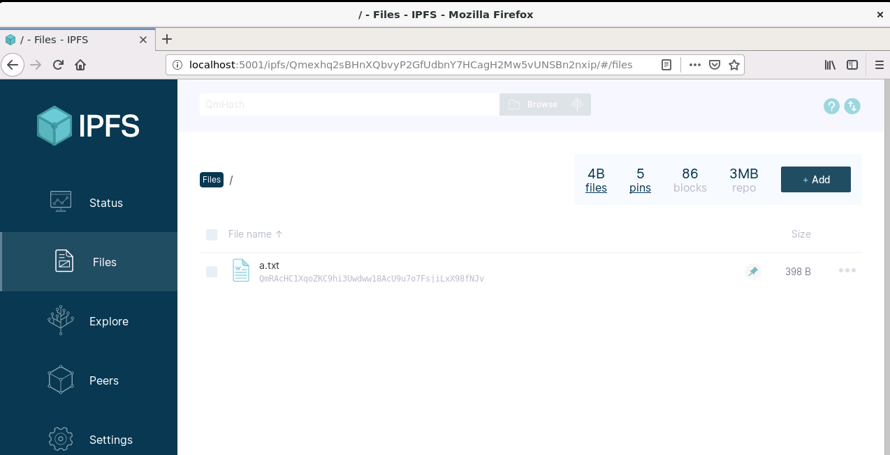

*****************************
ipfs
*****************************

去中心化web文件系统

二进制下载安装

.. code-block:: shell

    wget https://dist.ipfs.io/go-ipfs/v0.4.23/go-ipfs_v0.4.23_linux-arm64.tar.gz
    tar -xf go-ipfs_v0.4.23_linux-arm64.tar.gz
    sudo ./install.sh
    ipfs

.. code-block:: console

    me@ubuntu:~$ ipfs add a.txt
    added QmRAcHC1XgoZKC9hi3Uwdww18AcU9u7o7FsjiLxX98fNJv a.txt
     398 B / 398 B [=============================================================================================================================================================================] 100.00%me@ubuntu:~$ ipfs add a.png
    added QmWQJSkFsqcrg97sSLKGzPgXq5aawr3GJCoE4b45rTk78A a.png
     77.07 KiB / 77.07 KiB [=====================================================================================================================================================================] 100.00%me@ubuntu:~$ ipfs add app.js
    added QmaFR91MabEgYzZSoPv7PUkEmWMknGVoN9HGqypqNwdQz4 app.js
     234 B / 234 B [=============================================================================================================================================================================] 100.00%me@ubuntu:~$

go 包管理器下载安装

.. code-block:: shell

    go get github.com/jbenet/go-ipfs/cmd/ipfs

运行效果：

|image0|

