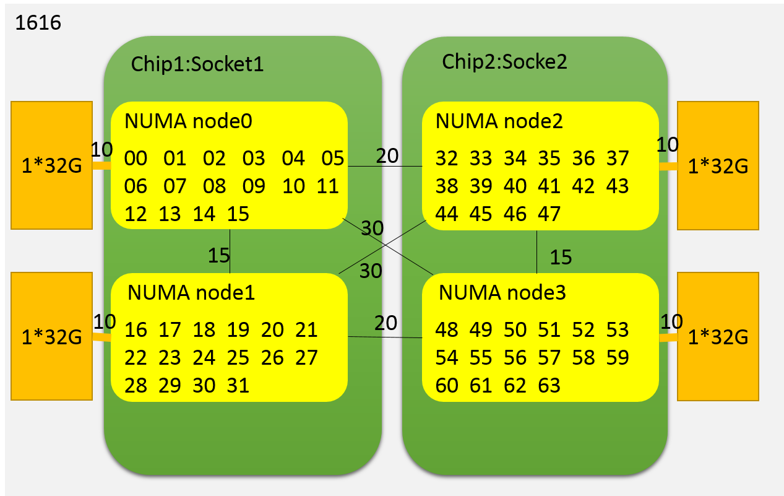
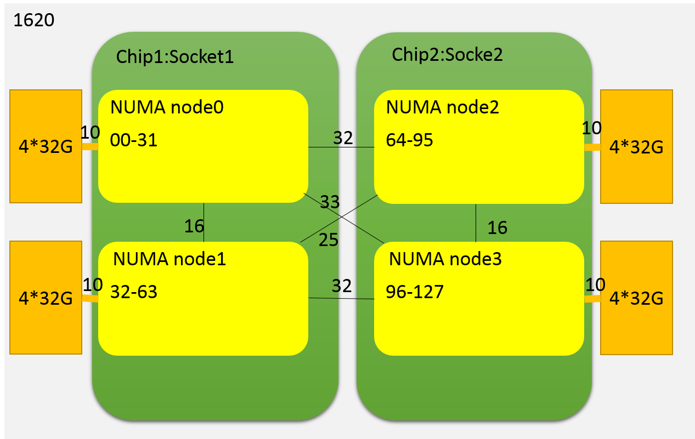

.. _numactl:

*********************
numactl
*********************

绑定numa节点

::

   numactl --physcpubind 0 --membind=0 ./lat_mem_rd -N 1 -P  1 10240M 512

1616 节点信息
=============

|image0| 插4根内存条：DIMM000，DIMM020，DIMM100，DIMM120
内核内存条刚好分配到4个NUMA节点

.. code::

   me@ubuntu:/sys/class$ lscpu
   Architecture:        aarch64
   Byte Order:          Little Endian
   CPU(s):              64
   On-line CPU(s) list: 0-63
   Thread(s) per core:  1
   Core(s) per socket:  32
   Socket(s):           2
   NUMA node(s):        4
   Vendor ID:           ARM
   Model:               2
   Model name:          Cortex-A72
   Stepping:            r0p2
   BogoMIPS:            100.00
   L1d cache:           32K
   L1i cache:           48K
   L2 cache:            1024K
   L3 cache:            16384K
   NUMA node0 CPU(s):   0-15
   NUMA node1 CPU(s):   16-31
   NUMA node2 CPU(s):   32-47
   NUMA node3 CPU(s):   48-63
   Flags:               fp asimd evtstrm aes pmull sha1 sha2 crc32 cupid

   me@ubuntu:/sys/class$ numactl --hardware
   available: 4 nodes (0-3)
   node 0 cpus: 0 1 2 3 4 5 6 7 8 9 10 11 12 13 14 15
   node 0 size: 32097 MB
   node 0 free: 25097 MB
   node 1 cpus: 16 17 18 19 20 21 22 23 24 25 26 27 28 29 30 31
   node 1 size: 32190 MB
   node 1 free: 30674 MB
   node 2 cpus: 32 33 34 35 36 37 38 39 40 41 42 43 44 45 46 47
   node 2 size: 32190 MB
   node 2 free: 27855 MB
   node 3 cpus: 48 49 50 51 52 53 54 55 56 57 58 59 60 61 62 63
   node 3 size: 32187 MB
   node 3 free: 22125 MB
   node distances:
   node   0   1   2   3
     0:  10  15  20  20
     1:  15  10  20  20
     2:  20  20  10  15
     3:  20  20  15  10

1620 numa节点信息
=================

|image1| 插16根内存条：内存条平均分配到了每个NUMA节点。

.. code::

   [root@CS home]# lscpu
   Architecture:          aarch64
   Byte Order:            Little Endian
   CPU(s):                128
   On-line CPU(s) list:   0-127
   Thread(s) per core:    1
   Core(s) per socket:    64
   Socket(s):             2
   NUMA node(s):          4
   Model:                 0
   CPU max MHz:           2600.0000
   CPU min MHz:           200.0000
   BogoMIPS:              200.00
   L1d cache:             64K
   L1i cache:             64K
   L2 cache:              512K
   L3 cache:              32768K
   NUMA node0 CPU(s):     0-31
   NUMA node1 CPU(s):     32-63
   NUMA node2 CPU(s):     64-95
   NUMA node3 CPU(s):     96-127
   Flags:                 fp asimd evtstrm aes pmull sha1 sha2 crc32 atomics fphp asimdhp cpuid asimdrdm jscvt fcma dcpop
   [root@CS home]# numactl --hardware
   available: 4 nodes (0-3)
   node 0 cpus: 0 1 2 3 4 5 6 7 8 9 10 11 12 13 14 15 16 17 18 19 20 21 22 23 24 25 26 27 28 29 30 31
   node 0 size: 130059 MB
   node 0 free: 125156 MB
   node 1 cpus: 32 33 34 35 36 37 38 39 40 41 42 43 44 45 46 47 48 49 50 51 52 53 54 55 56 57 58 59 60 61 62 63
   node 1 size: 130937 MB
   node 1 free: 127130 MB
   node 2 cpus: 64 65 66 67 68 69 70 71 72 73 74 75 76 77 78 79 80 81 82 83 84 85 86 87 88 89 90 91 92 93 94 95
   node 2 size: 130937 MB
   node 2 free: 113833 MB
   node 3 cpus: 96 97 98 99 100 101 102 103 104 105 106 107 108 109 110 111 112 113 114 115 116 117 118 119 120 121 122 123 124 125 126 127
   node 3 size: 130935 MB
   node 3 free: 130438 MB
   node distances:
   node   0   1   2   3
     0:  10  16  32  33
     1:  16  10  25  32
     2:  32  25  10  16
     3:  33  32  16  10

NUMA架构的内存分配， 调度策略，查看numa miss，有一篇文章 [#numa_acm]_ 写得非常好。 使用 :ref:`taskset` :ref:`numactl` 用于绑定指定线程到核心。

.. [#numa_acm] https://queue.acm.org/detail.cfm?id=2513149

