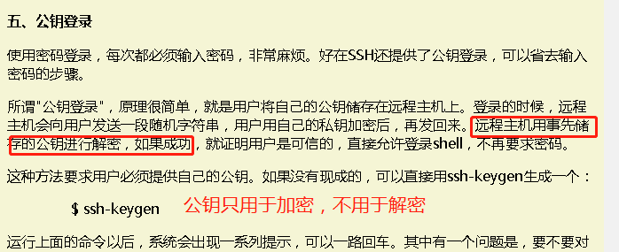
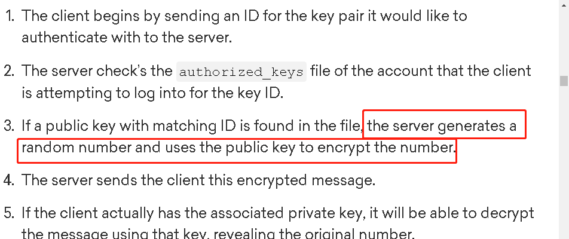

*************
ssh
*************

ssh 是非常普遍的登录方式

| ubuntu 默认情况下是不允许root用户通过ssh登录的。
| 修改/etc/ssh/sshd_config

::

   PermitRootLogin yes

跨越堡垒机scp
-------------

一台主机很多时候在一个防火墙/堡垒机后面，我们只能先登陆一台设备，再跳转到内网的设备上。上传下载文件的时候也需要这样操作。这就很繁琐了。
事实上，使用ssh tunnel转发，可以直接ssh内网设备或者拷贝文件。

::

                           +-----------------+
                           | gate_user       |
   +---------------+       | gate.machine.net|      +-------------------+
   |               |       | :8080           |      | target_user       |
   |  host 9999    +--------------------------------> target server     |
   |               |       |                 |      | 192.168.2.182:22  |
   +---------------+       |                 |      +-------------------+
                           |  Gate Server    |
                           |                 |
                           +-----------------+

使用单行命令

::

   scp -o "ProxyCommand ssh gate_user@gate.machine.net -p 8080 -W %h:%p" target_user@target.machine:/home/file.png .

使用多行命令

::

   ssh -f -N -L 19999:192.168.2.182:22 gate_user@gate.machine.net -p 8080
   ssh target-user@localhost -p 19999          #login into target server
   scp -P 19999 target-user@localhost:/remote/file  .

端口转发
--------------------

http://www.lining0806.com/

proxy web
------------------

::

   ssh -N -D 127.0.0.1:3128 xxx@xx.x.xx.xx -p 23231

命令会在前台执行，如果想在后台执行，使用-f参数

::

   ssh -f -N -D 127.0.0.1:3128 xxx@xx.x.xx.xx -p 23231

浏览器设置本地代理127.0.0.1:3128即可.

使用如下命令进行测试，如果能获取到网页内容，说明设置成功

::

   curl --socks5 127.0.0.1:3128 --verbose www.baidu.com
   curl -x socks5://127.0.0.1:3128 cip.cc

终端代理设置：

::

    export http_proxy=socks5://127.0.0.1:7777
    export https_proxy=socks5://127.0.0.1:7777

proxy yum
---------

1.　请确认您的socks5服务可以连接。

telnet your_socks5_server port

2. 修改/etc/yum.conf 文件

在文件的最后加入一行：

proxy=socks5://your_ip:port

proxy=socks5://192.168.0.47:3333

远程执行任务
------------

::

   ssh nick@xxx.xxx.xxx.xxx "df -h"                            #执行普通命令
   ssh nick@xxx.xxx.xxx.xxx -t "top"                           #执行交互命令
   ssh nick@xxx.xxx.xxx.xxx < test.sh                          #在远程主机上执行本地脚本
   ssh nick@xxx.xxx.xxx.xxx 'bash -s' < test.sh helloworld    #在远程主机上执行待参数的本地脚本
   ssh nick@xxx.xxx.xxx.xxx "/home/nick/test.sh"                #在远程主机上执行远程主机上的脚本

批量执行远程任务
----------------

很多时候希望在很多主机上批量执行任务

::

   pdsh -w ^all.txt -R ssh "uptime"

all.txt保存主机IP列表

::

   192.168.100.101
   192.168.100.102
   192.168.100.103
   192.168.100.104
   192.168.100.105
   192.168.100.106
   192.168.100.107
   192.168.100.108

所有得主机都应该设置免密登录，也就是ssh可以直接登录主机

::

   ssh 192.168.100.101

登陆失败后添加到黑名单
----------------------

https://www.cnblogs.com/panblack/p/secure_ssh_auto_block.html

.. _ssh_password_less:

设置免密登录
-------------

::

   ssh-keygen
   ssh-copy-id 192.168.100.101

禁止使用用户密码登录
--------------------

.. code:: diff

   diff --git a/etc/ssh/sshd_config b/sshd_config
   index 3194915..12a0d77 100644
   --- a/etc/ssh/sshd_config
   +++ b/sshd_config
   @@ -62,7 +62,7 @@ AuthorizedKeysFile    .ssh/authorized_keys
    # To disable tunneled clear text passwords, change to no here!
    #PasswordAuthentication yes
    #PermitEmptyPasswords no
   -PasswordAuthentication yes
   +PasswordAuthentication no

    # Change to no to disable s/key passwords
    #ChallengeResponseAuthentication yes

禁止后效果

::

   ──────────────────────────────────────────────────────────────────────────────────────────────────────────────────────────────────────

   Session stopped
       - Press <return> to exit tab
       - Press R to restart session
       - Press S to save terminal output to file

   Disconnected: No supported authentication methods available (server sent: publickey,gssapi-keyex,gssapi-with-mic)

设置多都端口
--------------
在/etc/ssh/sshd_config中添加多个port选项

::
    Port 22
    Port 2222

知识介绍
--------

非对称加密解密，公钥用于加密，私钥用于解密。

你可以将公钥发送给别人，加密后的数据只能通过你手中的私钥解密，第三者拦截到也没有意义。

一、https 的传输安全的原理
~~~~~~~~~~~~~~~~~~~~~~~~~~

|image0|

1、客户端请求服务端

2、服务端将用于数据加密的公钥 cert_pub 返回给客户端

3、客户端对公钥进行验证（有没过期啊，办法机构合不合法啊之类的）

4、客户端生成用于加密本次会话数据的密钥 sess_key，并通过服务端返回的
cert_pub 进行加密发送给服务端（安全传输，只有 cert_pri
的拥有者才能解密出此数据）

5、服务端通过私钥 cert_pri 解密拿到
sess_key，至此，服务端和客户端都拿到了加密会话传输数据的 sess_key

6、剩下的事件就是用 sess_key 加密发送数据，接受数据后用 sess_key
解密的工作了

二、ssh 密码登录
~~~~~~~~~~~~~~~~

1、客户端发送登录请求，ssh user@hostname

2、服务端接受请求，将服务端的公钥 ser_rsa.pub 发送给客户端

3、客户端输入密码，密码使用 ser_rsa.pub
加密后发送给服务端（敏感信息安全传输了）

4、服务端接受加密后的密码，使用服务端私钥 ser_rsa
解密，匹配认证密码是否合法

5、客户端生成会话数据加密 sess_key，使用 ser_rsa.pub
加密后传输给服务端（敏感信息安全传输了）

6、服务端获取到后使用 ser_rsa 解密，客户端和服务端通过 sess_key
进行会话数据安全传输

三、ssh 公钥认证登录
~~~~~~~~~~~~~~~~~~~~

所谓的密钥认证，实际上是使用一对加密字符串，一个称为公钥(public key)，
任何人都可以看到其内容，

用于加密；另一个称为密钥(private key)，只有拥有者才能看到，用于解密。
通过公钥加密过的密文使用密

钥可以轻松解密，但根据公钥来猜测密钥却十分困难。

ssh
的密钥认证就是使用了这一特性。服务器和客户端都各自拥有自己的公钥和密钥。
为了说明方便，以下

将使用这些符号。

-  cli_pub 客户端公钥

-  cli_pri 客户端密钥

-  ser_pub 服务器公钥

-  ser_pri 服务器密钥

在认证之前，客户端需要通过某种方法将公钥 cli_pub 注册到服务器上。

认证过程分为两个步骤。

1. 会话密钥(session key)生成

   1. 客户端 请求连接服务器，服务器将 ser_pub 发送给客户端。

   2. 服务器生成会话ID(session id)，设为 sess_id，发送给客户端。

   3. 客户端生成会话密钥(session key)，设为 sess_key，并计算 sess_xor =
      sess_id xor sess_key。

   4. 客户端将 sess_xor 用 ser_pub
      进行加密，结果发送给服务器。（敏感信息加密传输）

   5. 服务器用 ser_pri 进行解密，获得 sess_xor。

   6. 服务器进行 sess_xor xor sess_id 的运算，获得 sess_key。

   7. 至此服务器和客户端都知道了会话密钥 sess_key，以后的传输都将被
      sess_key 加密。

2. 认证

   1. 服务器 生成随机数 random_str，并用 cli_pub 加密后生成结果
      ency(random_str)，发送给客户端

   2. 客户端使用 cli_pri 解密 ency(random_str) 得到 random_str

   3. 客户端计算 sess_key+random_str 的 md5 值
      cli_md5(sess_key+random_str)，sess_key 为上一步得到的会话密钥

   4. 服务器计算 sess_key+random_str 的 md5 值
      ser_md5(sess_key+random_str)

   5. 客户端将 cli_md5(sess_key+random_str) 发送给服务器

   6. 服务器比较 ser_md5(sess_key+random_str) 和
      cli_md5(sess_key+random_str)，两者相同则认证

3. 传输

   1. 传输的话就使用会话密钥 sess_key 进行加密和解密传输

参考资料
--------

关于认证过程的说法， 后者是对的。

`【ruanyifeng】 <http://www.ruanyifeng.com/blog/2011/12/ssh_remote_login.html>`__
|image1|

`【Justin
Ellingwood】 <https://www.digitalocean.com/community/tutorials/understanding-the-ssh-encryption-and-connection-process>`__

|image2|

`【中文讲得比较好的参考】 <https://my.oschina.net/sallency/blog/1547785>`__

[https://my.oschina.net/sallency/blog/1547785)

.. |image0| image:: ../images/ssh_3.png

