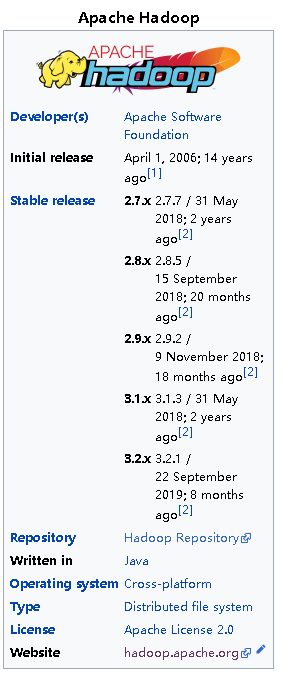

**************
wiki
**************

2020年6月5日09:30:33

是不是必须是json。::

    是。 如果是富文本： word，txt， rst。 需要约定格式， 除了业界大家资源遵守的格式，大家默认都不太喜欢格式。
    json可以像表格一样方便填写。

为什么不用excel ::

    没有人喜欢填写表格的字段。 表格版本控制，等于人工审核。 表格约束了展现形式。

模板引擎 ::

    还没有想好

要不要先渲染成rst ::

    如果不渲染成rst，就无法使用sphinx主题。 可以让前端帮忙看一下怎么生成sphinx主题。以软件名作为导航

2020年6月5日09:28:51：

一定是json吗 ::

    如果不是要机器读的话，直接编辑文档最方便

对于软件列表要尽可能少属性要尽可能少::

    解释软件是用来干嘛的， 从来不是我们要做的。 软件官网有详细的文档
    https://fedoraproject.org/wiki/Workstation/Third_party_software_list

刘琦建议gitbook是一个较好的选择 ::

    满足我的简单需求，导航+静态页面。
    可以随时带走

参考维基百科对软件的介绍 https://en.wikipedia.org/wiki/Apache_Hadoop

    介绍软件的事情不是我们应该做的

怎么获取软件也不是我们应该做的。 发行厂商是正规的获取渠道。 虽然很多工程师想要一个链接直接点击。
不管如何， 都应该从发行厂商处获取， 第三方渠道可信度并不好。 容易引起版权问题。

用 sphinx生成github pages https://github.com/sphinx-doc/sphinx/issues/3382